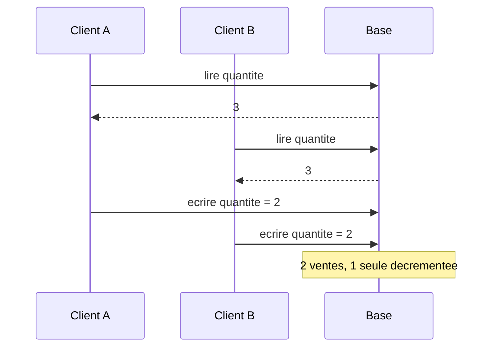
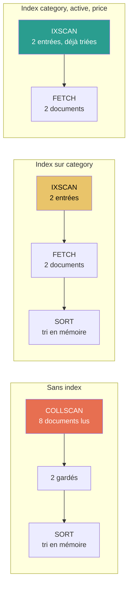
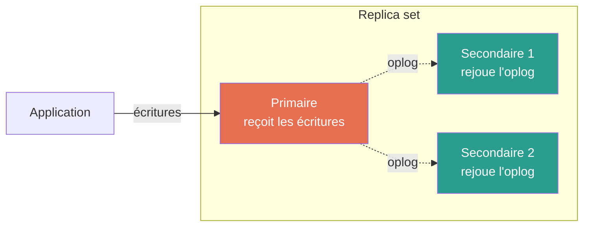
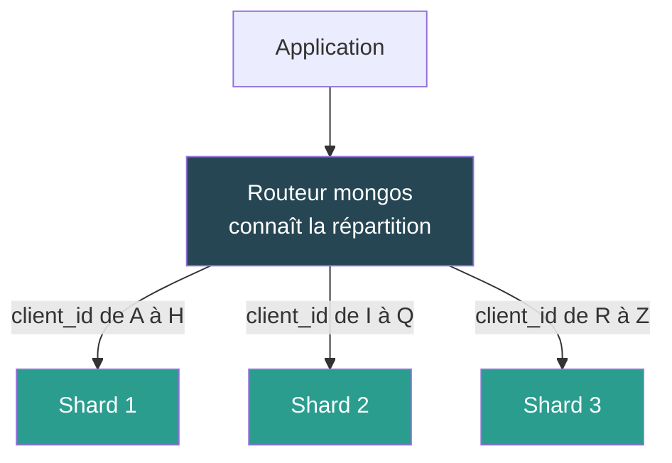
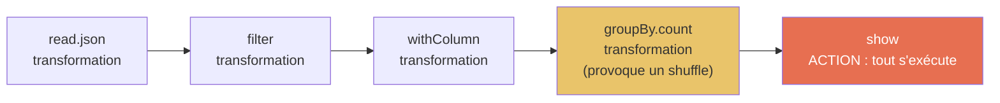
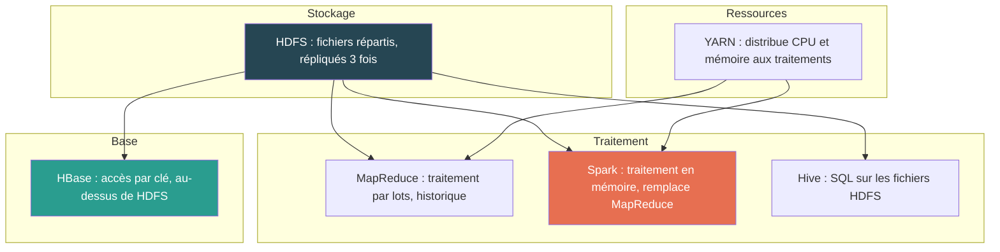

> [!NOTE]
> **Guide participant**
> Guide à suivre pendant la séance ou à rejouer seul ensuite. Il présente les mécanismes dans l'ordre de la formation, porte les manipulations et regroupe les corrigés en fin de document.

> [!TIP]
> **Navigation**
> - [Préparation](#préparation)
> - [Parcours pratique](#parcours-pratique)
> - [Du relationnel au NoSQL](#du-relationnel-au-nosql)
> - [Familles NoSQL et intégrité](#familles-nosql-et-intégrité)
> - [Modéliser et interroger avec MongoDB](#modéliser-et-interroger-avec-mongodb)
> - [Distribuer et exploiter MongoDB](#distribuer-et-exploiter-mongodb)
> - [Big Data et services managés](#big-data-et-services-managés)
> - [Migration](#migration)
> - [Checklist finale](#checklist-finale)
> - [Approfondissements](#approfondissements)

[Documentation officielle MongoDB](https://www.mongodb.com/docs/manual/) · [Dépôt du lab](https://github.com/jcdominguez/formation-nosql-lab)

> [!IMPORTANT]
> **Rester dans le parcours indiqué par le formateur**
> Le Guide contient aussi des explications et des prolongements pour rejouer ou approfondir la formation après la séance. Pendant les ateliers, ouvrir uniquement la section annoncée par le formateur et suivre ses étapes dans l'ordre.

Les repères utilisés tout au long du Guide : **À observer** invite à prédire un résultat avant de lancer la commande ; **À essayer** est une manipulation à faire ; **Piège** signale ce qui fait perdre du temps ; **Ce qu'il faut retenir** ferme chaque notion. Les corrigés des ateliers sont regroupés à la fin : tenter d'abord, consulter ensuite.

# Préparation

## Ce dont vous avez besoin

Un poste avec **Docker** en état de marche, un terminal, et un éditeur de texte. Rien d'autre : le lab fournit MongoDB, ses outils en ligne de commande et les données. Aucun compte cloud, aucune installation de MongoDB sur la machine.

| Système | Ce qu'il faut |
|---|---|
| Windows 11 | Docker Desktop avec le moteur WSL 2, et une distribution Linux (Ubuntu) pour ouvrir le terminal. Les commandes du Guide se lancent **dans ce terminal WSL**, pas dans PowerShell. |
| macOS | Docker Desktop (édition Intel ou Apple Silicon selon le processeur). Les commandes se lancent dans Terminal. |
| Linux | Docker Engine et le plugin Compose, le compte utilisateur ajouté au groupe `docker`. |

> [!TIP]
> **Options d’affichage dans le terminal**
>
> Le Guide utilise `cat`, car cette commande est disponible dans les terminaux macOS, Linux et WSL. Les commandes ci-dessous sont **facultatives** : si elles sont déjà disponibles sur votre poste, vous pouvez les utiliser **à la place de `cat`** pour faciliter la lecture.
>
> N’installez rien pour suivre la formation et n’exécutez pas toutes les commandes : choisissez seulement celle qui vous est utile.
>
> **JSON ou JSONL : indenter et colorer avec `jq`**
>
> ```bash
> jq . data/formats/02-capteur-iot.jsonl
> ```
>
> **CSV : aligner les champs avec `column`**
>
> ```bash
> column -s, -t < data/formats/04-clics.csv
> ```
>
> **Fichier texte long : parcourir page par page avec `less`**
>
> ```bash
> less data/formats/01-serveur-web.log
> ```
>
> Utilisez les flèches pour vous déplacer et appuyez sur `q` pour quitter.
>
> **Aperçu d’un fichier : afficher seulement les premières lignes avec `head`**
>
> ```bash
> head -n 5 data/evenements.jsonl
> ```
>
> `head` n’affiche qu’un extrait : ne l’utilisez pas lorsqu’un exercice demande d’examiner ou de compter toutes les lignes.

Vérifier que Docker répond :

```
docker version
```

Le résultat doit afficher un bloc `Client` **et** un bloc `Server`. Si le bloc `Server` manque, Docker Desktop n'est pas démarré : l'ouvrir et attendre l'icône stable dans la barre de menus.

```
docker compose version
```

> [!WARNING]
> **Piège : poste en machine virtuelle**
> Docker Desktop sous Windows exécute les conteneurs dans une machine virtuelle Linux. Si votre poste de formation est lui-même une VM, l'hyperviseur doit autoriser la virtualisation imbriquée, sinon WSL 2 ne démarre pas et Docker non plus. Ce réglage dépend de l'équipe qui a préparé la VM, pas de vos droits Windows. Le signaler au formateur dès le début plutôt qu'après une heure d'essais.

## Récupérer le lab

Tout le matériel de la formation est dans un dépôt Git public. Avec Git :

```
git clone https://github.com/jcdominguez/formation-nosql-lab.git
```

Sans Git : bouton **Code → Download ZIP** sur la page GitHub du dépôt, puis décompresser dans un dossier où vous avez le droit d'écrire. Le dossier doit s'appeler `formation-nosql-lab`.

Puis se placer dedans. Tous les chemins du Guide partent de cette racine :

```
cd formation-nosql-lab
```

Ce que contient le dépôt :

```text
formation-nosql-lab/
├── compose.yaml        # décrit les conteneurs : MongoDB, et HBase/Spark pour les démos
├── data/               # catalogue de produits, événements de navigation, formats bruts
├── scripts/            # load-data.sh : charge ou remet à zéro les données
├── exercices/          # un dossier par atelier, avec son énoncé
├── solutions/          # les corrigés exécutables, à ouvrir après avoir tenté
└── demos/              # scripts des démonstrations HBase et Spark
```

Ce qui **n'existe pas** dans le dépôt, pour ne pas le chercher : aucune application à lancer, aucun code Java ou Python à compiler pour les ateliers, aucune base à installer. Les ateliers se jouent dans le shell MongoDB, et les démonstrations Big Data sont exécutées par le formateur.

## Le fil rouge : une boutique en ligne

Toutes les manipulations portent sur les données d'une même boutique. Il n'y a rien à mémoriser, seulement à reconnaître :

> [!NOTE]
> **Format JSONL**
> JSONL signifie *JSON Lines* : chaque ligne du fichier contient un document JSON complet et indépendant. Contrairement à un fichier JSON classique, les documents ne sont pas regroupés dans un tableau englobant. Ce format permet de lire ou d'importer les données progressivement, une ligne après l'autre.

| Donnée | Ce que c'est | Fichier |
|---|---|---|
| Produits | Un catalogue de 8 produits de catégories différentes (appareil photo, casque, sac, café…), chacun avec ses attributs propres | `data/catalogue-produits.jsonl` |
| Événements | 16 événements de navigation : produit consulté, ajout au panier, passage en caisse, achat, abandon | `data/evenements.jsonl` |

Un produit ressemble à ceci :

```json
{
  "product_id": "P101",
  "category": "appareil-photo",
  "name": "Horizon X100",
  "active": true,
  "price": 749,
  "attributes": { "sensor": "APS-C", "stabilization": true, "color": "noir" },
  "media": [ { "kind": "image", "path": "media/P101-front.jpg" } ]
}
```

Un événement ressemble à ceci :

```json
{
  "event_id": "E000183",
  "occurred_at": "2026-09-12T10:02:15Z",
  "event_type": "cart_item_added",
  "session_id": "S0184",
  "client_id": "C042",
  "product_id": "P103",
  "channel": "mobile",
  "payload": { "quantity": 1 }
}
```

## Démarrer MongoDB

Depuis la racine du dépôt :

```
docker compose up -d --wait
```

Le premier lancement télécharge l'image MongoDB (quelques centaines de Mo) : le faire avant la formation, sur le réseau où vous serez le jour J. Les fois suivantes, le démarrage prend quelques secondes.

Contrôler l'état :

```
docker compose ps
```

Résultat attendu : le service `mongodb` en état `Up … (healthy)`. Tant que `healthy` n'apparaît pas, la base n'accepte pas encore de connexion.

```text
NAME                            STATUS
formation-nosql-lab-mongodb-1   Up 6 seconds (healthy)
```

## Charger les données

```
sh scripts/load-data.sh
```

Le script recrée les deux collections à partir des fichiers de `data/` et affiche, en dernière ligne, le compte des documents :

```text
{"produits":8,"evenements":16}
```

Ce sont les deux nombres à retrouver. Ce même script sert de **remise à zéro** : à relancer chaque fois qu'un atelier a modifié les données et qu'il faut repartir de l'état de référence.

> [!CAUTION]
> `load-data.sh` **remplace** les collections `produits` et `evenements`. Tout ce que vous y aurez ajouté ou modifié est perdu. C'est voulu pendant la formation ; ne pas le lancer sur une base qui contiendrait autre chose.

## Ouvrir le shell MongoDB

Le shell s'appelle `mongosh`. Il est déjà dans le conteneur, on l'ouvre depuis l'extérieur :

```
docker compose exec mongodb mongosh mongodb://localhost:27017/formation_nosql
```

L'invite devient `formation_nosql>`. Trois commandes pour vérifier que tout est en place :

```
db.getName()
```

```
show collections
```

```
db.produits.findOne({ product_id: "P101" }, { _id: 0 })
```

> [!NOTE]
> **Lire les deux paramètres de `findOne`**
> La commande suit la forme `findOne(filtre, projection)`. Le premier objet, `{ product_id: "P101" }`, est le **filtre** : il indique quel document rechercher. Le second, `{ _id: 0 }`, est la **projection** : il indique quels champs afficher ou masquer dans le résultat.
>
> MongoDB ajoute automatiquement un champ `_id` à chaque document qui n'en possède pas. Cet identifiant est unique dans la collection. Dans une projection, `0` signifie « exclure ce champ du résultat » et `1` signifie « inclure ce champ dans le résultat ».
>
> Une projection par exclusion, comme `{ _id: 0 }`, conserve tous les autres champs. Une projection par inclusion, comme `{ name: 1, price: 1 }`, ne conserve que les champs demandés, ainsi que `_id` par défaut. Pour masquer aussi cet identifiant : `{ name: 1, price: 1, _id: 0 }`.
>
> Il ne faut généralement pas mélanger inclusion et exclusion dans une même projection : `{ name: 1, price: 0 }` est invalide. `_id` est l'exception, il peut être exclu avec `0` dans une projection par inclusion. La projection ne modifie jamais le document stocké, elle change seulement ce que la requête retourne.

La dernière affiche le produit P101 sous la forme vue plus haut. Pour quitter le shell : `exit` ou Ctrl+D. Le conteneur continue de tourner.

> [!TIP]
> **Le rituel des ateliers**
> Chaque manipulation suit le même ordre : **lire** la commande, **prédire** ce qu'elle va afficher (un nombre, une liste, une erreur), **exécuter**, **comparer**. La prédiction est ce qui fait apprendre ; l'exécution seule ne fait que confirmer. Quand le résultat surprend, c'est le moment le plus utile de la formation : le noter, et le poser au formateur ou chercher dans le Guide.

## Arrêter et reprendre

En fin de journée, arrêter le conteneur en gardant les données :

```
docker compose down
```

Le lendemain, `docker compose up -d --wait` retrouve les données telles que laissées. Pour tout effacer, y compris le volume de données :

```
docker compose down --volumes
```

## Dépannage

| Symptôme | Cause probable | Correctif |
|---|---|---|
| `Cannot connect to the Docker daemon` | Docker Desktop n'est pas lancé | Ouvrir Docker Desktop, attendre le démarrage, relancer |
| `docker: command not found` dans WSL | Intégration WSL non activée pour la distribution | Docker Desktop → Settings → Resources → WSL integration, cocher la distribution, rouvrir le terminal |
| `permission denied` sur `docker.sock` (Linux) | Compte hors du groupe `docker` | `sudo usermod -aG docker $USER`, puis fermer et rouvrir la session |
| Le service reste `starting`, jamais `healthy` | Image incomplète ou port occupé | `docker compose logs mongodb` pour lire l'erreur ; vérifier que rien n'écoute déjà sur le port 27017 |
| `load-data.sh` ne trouve pas les fichiers | Lancé depuis un autre dossier, ou fins de ligne Windows | Se placer à la racine du dépôt ; si le ZIP a été décompressé par un outil qui convertit en CRLF, relancer avec `sh scripts/load-data.sh` depuis WSL |
| `mongosh` refuse la connexion | Base pas encore `healthy` | Attendre `docker compose ps` en `healthy`, puis réessayer |

# Parcours pratique

<!-- parcours-pratique:auto -->

Cette page permet d'enchaîner directement les manipulations sans rechercher leurs énoncés dans les chapitres. La [Préparation](#préparation) reste nécessaire avant de commencer. Les corrigés sont regroupés [à la fin du Guide](#corrigés).

## Exercices du parcours principal

1. [Atelier 0 : quatre formats de données face au relationnel](#atelier-0-quatre-formats-de-données-face-au-relationnel)
2. [Atelier 1 : premiers pas avec le shell de MongoDB](#atelier-1-premiers-pas-avec-le-shell-de-mongodb)
3. [Atelier 2 : création de bases et de collections](#atelier-2-création-de-bases-et-de-collections)
4. [Atelier 3 : intégration de données au format JSON](#atelier-3-intégration-de-données-au-format-json)
5. [Atelier 4 : requêtage sur ces données](#atelier-4-requêtage-sur-ces-données)
6. [Atelier 5 : mise en place d'index et observation des requêtes](#atelier-5-mise-en-place-dindex-et-observation-des-requêtes)

## Démonstrations du formateur

- [Manipuler des données avec HBase](#démonstration-manipuler-des-données-avec-hbase)
- [Nettoyer un gros volume selon un motif imposé](#démonstration-nettoyer-un-gros-volume-selon-un-motif-imposé)
- [Traiter un gros volume avec Spark au-dessus d'une base NoSQL](#démonstration-traiter-un-gros-volume-avec-spark-au-dessus-dune-base-nosql)
- [Visiter l'offre NoSQL d'un acteur majeur](#démonstration-visite-guidée-de-loffre-nosql-dun-acteur-majeur)

## Exercices facultatifs

- [Observer le format des données sur Cassandra, Redis et MongoDB](#atelier-observer-le-format-des-données-sur-cassandra-redis-et-mongodb)
- [Construire la matrice de synthèse](#atelier-construire-la-matrice-de-synthèse)

## Corrigés

[Accéder aux corrigés des exercices](#corrigés-2). Tenter chaque exercice avant d'ouvrir cette section.

# Du relationnel au NoSQL

Cette première section pose le vocabulaire commun. Elle part de ce que tout le monde connaît, une base relationnelle, pour montrer sur des données réelles à quel moment ce modèle se met à coûter cher, et ce que NoSQL propose à la place. Rien n'y est encore manipulé dans MongoDB : l'atelier de fin de section se fait avec les fichiers du dossier `data/formats/`.

## Rappels sur la philosophie des SGBDR

Une base relationnelle organise les données en tables reliées entre elles. Les colonnes possèdent des types ; les contraintes peuvent contrôler les identifiants, les références, l’unicité et les valeurs obligatoires. Le schéma peut évoluer.

La normalisation répartit les informations pour limiter les duplications. Les jointures permettent de recomposer les résultats. Leur coût dépend des données, des index, des requêtes et du moteur ; leur présence n’est pas en soi un défaut.

Les transactions ACID permettent de grouper des modifications avec des garanties d’atomicité, de cohérence, d’isolation et de durabilité. Les garanties précises dépendent notamment du niveau d’isolation et de la configuration.

Pour le catalogue, plusieurs modèles sont possibles : colonnes communes et tables par catégorie, table d’attributs, ou colonnes communes accompagnées d’un document JSON pour les attributs variables. Une table clé-valeur dont toutes les valeurs sont du texte est un choix particulier, pas une obligation du relationnel.

PostgreSQL propose les types `json` et `jsonb`, des opérations sur leurs champs et des index sur `jsonb`. Une nouvelle propriété JSON n’impose donc pas une nouvelle colonne. [Documentation PostgreSQL : types JSON](https://www.postgresql.org/docs/current/datatype-json.html).

**Ce qu’il faut retenir.** Comparer une organisation des données et un moteur précis. Une structure variable peut se représenter dans un SGBDR moderne.

## Données structurées et non structurées

Le mot « structuré » ne veut pas dire « organisé ». Il veut dire : **la structure est connue à l'avance et identique pour toutes les lignes**.

| Forme | Structure | Exemple du fil rouge | Ce qui la lit facilement |
|---|---|---|---|
| Structurée | Fixe, déclarée, les mêmes colonnes pour tout le monde | La table `produits` ci-dessus, un export CSV de commandes | SQL |
| Semi-structurée | Portée par la donnée elle-même (balises, clés), variable d'un enregistrement à l'autre | Un produit JSON avec ses `attributes` propres à sa catégorie, une ligne de log, un message IoT | Un parseur JSON ou XML, une base documentaire |
| Non structurée | Aucune structure exploitable sans traitement | Le texte d'un avis client, la photo `P101-front.jpg`, une vidéo de démonstration | Un moteur de recherche, un traitement d'image, un modèle de langage |

Le point qui compte : dans la seconde ligne, la structure existe, elle est même très précise (`temperature_c` est un nombre, `ts` une date). Mais elle **change d'un enregistrement à l'autre**. Si l’on choisit une table unique avec une colonne par champ, il faut prévoir la réunion des variantes. Des tables par type ou une colonne JSON constituent d’autres choix.

**À observer.** Ouvrir `data/formats/02-capteur-iot.jsonl` et compter, avant de lire la réponse, combien de colonnes il faudrait à une table unique pour accueillir les sept lignes sans rien perdre.

```
cat data/formats/02-capteur-iot.jsonl
```

Réponse en fin de Guide, dans le corrigé de l'atelier.

**Ce qu'il faut retenir.** Semi-structuré ne veut pas dire mal structuré : la structure est là, mais elle voyage avec chaque donnée au lieu d'être fixée dans un schéma central.

## Les nouvelles sources de données

Trois sources se sont ajoutées aux données de gestion, et aucune n'a été produite pour rentrer dans une table.

**Les journaux de serveurs.** Chaque requête HTTP produit une ligne. Le format est fixe en apparence, mais l'agent utilisateur, le référent, le code de retour racontent des choses différentes selon la ligne, et le volume est celui du trafic : des millions de lignes par jour sur un site moyen. On ne les lit jamais une par une ; on les compte, on les filtre, on cherche une anomalie.

```text
203.0.113.42 - - [12/Sep/2026:09:58:10 +0000] "GET /produits/P101 HTTP/1.1" 200 18342 "https://www.example.com/" "Mozilla/5.0 (iPhone; …)"
```

**Les objets connectés.** Un capteur envoie ce qu'il mesure, au rythme qu'il veut, avec les champs qu'il a. Un thermomètre envoie une température, parfois une humidité, parfois une erreur. Une porte envoie un état. Un GPS envoie une position. Le même flux mélange tout, et un capteur en panne envoie `null`.

```json
{"device_id":"entrepot-A-temp-03","ts":"2026-09-12T10:01:00Z","temperature_c":null,"error":"sensor_timeout"}
```

**Les sites web et leurs parcours.** Une page produit est du HTML : un titre, un prix, des caractéristiques en liste, des avis en texte libre, une image. Et derrière la page, la trace du visiteur : ce qu'il a regardé, mis au panier, abandonné. Cette trace n'a pas de « ligne finale » : c'est une suite d'événements, dont l'intérêt est la séquence.

Ces sources demandent de distinguer la préparation du format, la représentation des informations et les opérations à réaliser. Un journal peut avoir une structure stable ; un message isolé peut être essentiel au diagnostic. La validation avant écriture et les requêtes d’agrégation sont possibles en relationnel comme avec certains moteurs NoSQL.

**Ce qu’il faut retenir.** Le format ne suffit pas à déterminer le stockage. Il faut connaître les accès, les garanties et la charge réelle.

## Évolutions technologiques et avènement du NoSQL

Une charge croissante peut conduire à augmenter la capacité d’une machine (*scale-up*) ou à répartir le travail sur plusieurs machines (*scale-out*). La charge comprend le volume conservé, le débit de lectures et d’écritures, les accès simultanés et les délais de réponse attendus.

Répartir introduit des échanges réseau, un choix de distribution des données et des mécanismes de coordination. Le coût ne croît pas nécessairement de façon linéaire et la capacité n’est pas sans limite.

Les travaux Bigtable et Dynamo illustrent des réponses historiques à des besoins de distribution et de disponibilité. Ils ne définissent pas toutes les bases NoSQL actuelles : [Bigtable, Google Research](https://research.google/pubs/bigtable-a-distributed-storage-system-for-structured-data/) et [Dynamo, Amazon Science](https://www.amazon.science/publications/dynamo-amazons-highly-available-key-value-store).

Des moteurs SQL distribués existent également. Spanner répartit les données en conservant une cohérence forte : [architecture de Spanner](https://docs.cloud.google.com/spanner/docs/whitepapers/life-of-reads-and-writes).

**Ce qu’il faut retenir.** Le besoin de distribution invite à comparer des architectures ; il n’impose pas à lui seul SQL ou NoSQL.

## Champs d'application des bases NoSQL et des SGBDR

La forme des données, les opérations à effectuer, les garanties attendues et la charge orientent ensemble le choix d’une base. Aucun de ces critères, pris isolément, n’impose SQL ou NoSQL.

| Besoin | Options à comparer | Critères |
|---|---|---|
| Commandes, paiements, stock | SGBDR ; moteur documentaire avec transactions adaptées | Contraintes, atomicité, isolation et exploitation |
| Catalogue à attributs variables | Tables spécialisées, JSON dans PostgreSQL, documents MongoDB | Recherches, évolution et mises à jour |
| Sessions et paniers | Relationnel, clé-valeur ou documents | Accès par session, expiration, durabilité et débit |
| Journaux et événements | Tables, documents, colonnes larges ou fichiers avec moteur analytique | Ingestion, rétention et requêtes |
| Rapports croisés | Relationnel ou moteur analytique | Jointures, agrégations et fraîcheur |
| Parcours de relations | Relationnel ou graphe | Types de parcours et coût mesuré |

MongoDB prend en charge les transactions sur plusieurs documents, y compris dans des clusters répartis ; elles ont un coût et ne remplacent pas la conception du modèle. [Transactions MongoDB 7.0](https://www.mongodb.com/docs/v7.0/core/transactions/).

**Ce qu’il faut retenir.** La formation utilise MongoDB pour pratiquer le modèle documentaire. Elle ne démontre pas qu’il est préférable pour toute boutique.

## Avantages et inconvénients par rapport aux bases classiques

Les bénéfices et contraintes dépendent du moteur et de sa configuration.

| Choix | Bénéfice possible | Contrepartie à examiner |
|---|---|---|
| Schéma flexible | Faire évoluer les documents | Validation et compatibilité des lecteurs |
| Regroupement en documents | Lire ensemble des informations liées | Taille du document et mises à jour |
| Duplication | Éviter certaines lectures croisées | Maintien de la cohérence des copies |
| Distribution | Répartir la charge | Clés, réseau, coordination et exploitation |
| Lectures sur des copies | Répartir les lectures | Fraîcheur exigée |

MongoDB permet une validation de schéma et des transactions ; la recherche par critères n’est pas réservée au relationnel. Il faut vérifier chaque capacité dans le moteur retenu. [Modélisation MongoDB](https://www.mongodb.com/docs/manual/data-modeling/).

**Ce qu’il faut retenir.** Aucun renoncement aux jointures, aux recherches par critères ou aux transactions ne définit à lui seul toutes les bases NoSQL.

## Atelier 0 : quatre formats de données face au relationnel

L’objectif : observer quatre formats de données, identifier les informations à exploiter et comparer plusieurs façons de les organiser. Distinguer les difficultés de préparation, de modélisation et de traitement, sans déduire du seul format le choix d’une base.

> [!IMPORTANT]
> **Manipulation guidée**
> Copiez-collez les commandes telles quelles. Pour l’instant, concentrez-vous sur les fichiers et les résultats obtenus. Les commandes MongoDB seront expliquées progressivement dans les ateliers suivants ; la commande JavaScript qui affiche les noms des champs est seulement un outil d’observation.

Les quatre fichiers sont dans `data/formats/` :

| Fichier | Source | Format |
|---|---|---|
| `01-serveur-web.log` | Journal d'un serveur web, 6 requêtes | Texte, un enregistrement par ligne, format Apache combiné |
| `02-capteur-iot.jsonl` | Messages de trois objets connectés d'un entrepôt, 7 messages | JSON, un objet par ligne |
| `03-page-produit.html` | La page web du produit P101 | HTML |
| `04-clics.csv` | Parcours de deux visiteurs sur le site, 8 événements | CSV avec en-tête |

### Étape 1 : lire les quatre fichiers

Dans le terminal, depuis la racine du lab. Si l’invite affiche `formation_nosql>`, quitter d’abord `mongosh` avec `exit`.

```
cat data/formats/01-serveur-web.log
```

```
cat data/formats/02-capteur-iot.jsonl
```

```
cat data/formats/03-page-produit.html
```

```
cat data/formats/04-clics.csv
```

### Étape 2 : proposer une table pour chacun

Pour chaque fichier, répondre avant de consulter le corrigé :

1. Quelles informations contient-il et lesquelles faut-il extraire ou transformer ?
2. Comment les représenter dans une table, plusieurs tables ou des documents ? Pour une table unique à colonnes fixes, quels types et quelles cellules vides prévoir ?
3. Quelle opération souhaite-t-on effectuer : recherche, agrégation, parcours ou mise à jour ?
4. Que faudrait-il modifier si la source ajoutait un champ ?
5. Quelles informations manquent pour choisir un moteur : volume, débit, délai de réponse, garanties ou contraintes d’exploitation ?

La table unique est une hypothèse à examiner, pas la seule représentation relationnelle.

### Étape 3 : importer le fichier JSON tel quel

Dans le terminal, depuis la racine du lab, importer le fichier IoT dans une collection `capteurs` :

```
docker compose exec -T mongodb mongoimport --db=formation_nosql --collection=capteurs --drop --file=/lab/data/formats/02-capteur-iot.jsonl
```

Résultat attendu :

```text
7 document(s) imported successfully. 0 document(s) failed to import.
```

Ouvrir ensuite `mongosh` depuis le terminal :

```
docker compose exec mongodb mongosh mongodb://localhost:27017/formation_nosql
```

À l’invite `formation_nosql>`, afficher les champs présents dans chaque document :

```
db.capteurs.find({}, { _id: 0 }).forEach(d => print(Object.keys(d).join(", ")))
```

**À observer** : chaque document a sa propre liste de champs, sans colonne à déclarer pour chaque mesure. Un champ absent est distinct d’un champ présent contenant `null`. L'ordre d'affichage peut différer de l'ordre du fichier.

Une requête sur un champ que seuls certains documents possèdent fonctionne quand même :

```
db.capteurs.find({ temperature_c: { $gt: 18.5 } }, { _id: 0, device_id: 1, ts: 1, temperature_c: 1 })
```

Et compter ceux qui n'ont pas ce champ :

```
db.capteurs.countDocuments({ temperature_c: { $exists: false } })
```

> [!NOTE]
> **Question : et le message avec `"temperature_c": null` ?**
> Il est importé comme les autres, avec un champ `temperature_c` dont la valeur est `null`. Il n'est **pas** compté par `$exists: false` (le champ existe), et il n'est pas retourné par `$gt: 18.5` (`null` n'est pas comparable à un nombre). La souplesse a un prix : c'est à celui qui interroge de savoir que ce cas existe.

Nettoyer avant de continuer :

```
db.capteurs.drop()
```

### Étape 4 : conclure

Pour chaque fichier, présenter une représentation possible, une opération attendue et une information manquante pour choisir un moteur. Comparer avec le corrigé.

L’import dans MongoDB montre une façon de conserver des documents variables. PostgreSQL peut également les conserver dans une colonne JSON ; cet atelier ne compare pas les performances des deux moteurs.

**Ce qu’il faut retenir.** Ces petits fichiers permettent d’observer les formats et de discuter la modélisation. Ils ne prouvent aucune limite de performance ni l’inadaptation du relationnel. Le choix dépend de la forme, des opérations, des garanties et de la charge.

# Familles NoSQL et intégrité

« NoSQL » regroupe plusieurs familles de modèles et de moteurs. Cette section présente quatre familles sur le fil rouge. Leurs accès privilégiés orientent la comparaison, avec la charge, les garanties et les contraintes d’exploitation. L’intégrité peut être contrôlée par la base et par l’application : il faut préciser leurs responsabilités selon le moteur retenu.

## Principaux acteurs et solutions du marché

| Famille | Unité de stockage | Accès pour lequel elle est conçue | Moteurs |
|---|---|---|---|
| Clé-valeur | Une clé, une valeur opaque ou simple | Lire ou écrire **une** valeur par sa clé, très vite, très souvent | Redis, Valkey, Amazon DynamoDB, Riak, Memcached |
| Document | Un document JSON ou BSON, avec ses sous-objets | Lire ou écrire un objet complet, l'interroger par ses champs | MongoDB, Couchbase, CouchDB, Amazon DocumentDB, Azure Cosmos DB |
| Colonnes larges | Une ligne identifiée par une clé, des colonnes groupées en familles | Parcourir des plages de clés triées, sur des milliards de lignes réparties | Apache HBase, Apache Cassandra, Google Bigtable, ScyllaDB |
| Graphe | Des nœuds et des relations, tous deux porteurs de propriétés | Suivre des liens de proche en proche (qui connaît qui, quoi va avec quoi) | Neo4j, Amazon Neptune, ArangoDB |

Deux remarques pour lire ce tableau sans se tromper.

Les frontières sont poreuses : Redis stocke aussi des structures (listes, tables de hachage), MongoDB sait faire des requêtes de graphe simples, Cassandra accepte un JSON dans une colonne. Une famille se reconnaît à **l'accès pour lequel elle est optimisée**, pas à ce qu'elle tolère.

Les moteurs cloud (DynamoDB, Cosmos DB, Bigtable) sont des services : on n'installe rien, on paie à l'usage, et on renonce à voir ce qui se passe à l'intérieur. Ils réapparaissent dans le chapitre « Big Data et services managés ».

**Ce qu'il faut retenir.** Quatre familles, quatre formes d'accès. La question à poser avant de choisir n'est pas « quel moteur » mais « comment je lis, comment j'écris ».

## Les bases de données clé-valeur

Le modèle le plus simple qui existe : une **clé** (une chaîne), une **valeur**. La base ne regarde pas la valeur, elle ne l'indexe pas, elle ne la filtre pas. Elle sait faire trois choses : écrire une valeur sous une clé, la lire par sa clé, l'effacer. Et parce qu'elle ne fait que cela, elle le fait en mémoire, en quelques microsecondes.

Sur le fil rouge, la session d'un visiteur et son panier sont le cas typique : des millions d'écritures courtes, chacune lue par sa clé (l'identifiant de session), jamais croisées avec autre chose, et qui n'ont plus de valeur une demi-heure après le départ du visiteur.

Redis est le moteur de référence. Le lab le fournit dans un profil séparé, pour ne pas alourdir le démarrage de MongoDB :

```
docker compose --profile familles up -d --wait redis
```

Puis ouvrir son client en ligne de commande :

```
docker compose exec redis redis-cli
```

**À essayer.** Enregistrer le client d'une session, puis le relire :

```
SET session:S0184:client C042
```

```
GET session:S0184:client
```

Le nom de la clé, `session:S0184:client`, est une convention et non une structure : Redis y voit une chaîne. Les deux-points servent à l'humain qui liste les clés, pas au moteur.

Le panier est un peu plus qu'une valeur : plusieurs produits, chacun avec une quantité. Redis propose pour cela une **table de hachage** sous une clé :

```
HSET panier:S0184 P103 1
```

```
HSET panier:S0184 P101 2
```

```
HGETALL panier:S0184
```

Ajouter un exemplaire de P103 se fait sans relire le panier, en une commande atomique :

```
HINCRBY panier:S0184 P103 1
```

Le point qui fait choisir Redis pour les sessions : une clé peut avoir une **durée de vie**. Le panier disparaît tout seul trente minutes plus tard, sans tâche de nettoyage :

```
EXPIRE panier:S0184 1800
```

```
TTL panier:S0184
```

**À observer.** Que retourne `GET panier:S0184` ? Prédire avant d'essayer.

```
GET panier:S0184
```

Réponse dans le corrigé de l'atelier « observer les formats ».

> [!WARNING]
> **Piège : la base ne sait rien de la valeur**
> « Tous les paniers qui contiennent P103 » n'est pas une requête Redis. Il faudrait parcourir toutes les clés `panier:*` et lire chacune. Une base clé-valeur répond à « donne-moi la valeur de cette clé », jamais à « quelles clés ont telle valeur ». Si ce second besoin existe, c'est une autre famille, ou une seconde structure maintenue à la main.

**Ce qu'il faut retenir.** Clé-valeur : l'accès le plus rapide qui existe, au prix de n'avoir qu'un seul chemin d'accès, la clé. Parfait pour ce qui se lit par identifiant et expire vite.

## Comment gérer l'intégrité des données ?

C'est la question que le relationnel réglait pour nous, et que chaque famille NoSQL renvoie à l'application. Elle se pose à trois niveaux, du plus simple au plus difficile.

### Premier niveau : la forme d'une donnée

Une base sans schéma accepte tout. Le fil rouge en donne l'exemple immédiat : rien n'empêche d'écrire un stock dont la quantité est le mot « beaucoup ».

**À essayer.** Dans `mongosh` :

```
db.stock.insertOne({ product_id: "P101", quantite: "beaucoup" })
```

```
db.stock.findOne({}, { _id: 0 })
```

La base a accepté. Aucune erreur, et la prochaine application qui fera `quantite - 1` obtiendra `NaN`.

La réponse de MongoDB est une **validation déclarée sur la collection**. Elle n'est pas obligatoire, c'est un choix, et c'est ce qui la distingue du schéma relationnel : la base ne l'impose pas, l'équipe la décide.

```
db.stock.drop()
```

```
db.createCollection("stock", { validator: { $jsonSchema: {
  bsonType: "object",
  required: ["product_id", "quantite"],
  properties: {
    product_id: { bsonType: "string" },
    quantite:   { bsonType: "int", minimum: 0 }
  }
} } })
```

Ce bloc se lit ainsi. `validator` est la règle que MongoDB applique à chaque document écrit dans la collection. `$jsonSchema` indique que cette règle est exprimée en **JSON Schema**, un standard indépendant de MongoDB qui décrit la forme attendue d'un document JSON. Ses mots-clés :

| Mot-clé | Rôle | Dans l'exemple |
|---|---|---|
| `bsonType` | Type attendu, dans le vocabulaire BSON de MongoDB (`object`, `string`, `int`, `double`, `array`, `date`…) | Le document est un objet, `product_id` une chaîne, `quantite` un entier |
| `required` | Liste des champs qui doivent être présents | `product_id` et `quantite` |
| `properties` | Règle par champ ; un champ absent de cette liste est accepté sans contrôle | Deux champs décrits |
| `minimum` | Borne basse d'un nombre | La quantité ne descend pas sous 0 |

Deux réglages complètent le validateur, avec des valeurs par défaut à connaître. `validationAction` vaut `error` : le document non conforme est refusé ; avec `warn`, il est accepté et une ligne est écrite dans le journal du serveur. `validationLevel` vaut `strict` : tout insert et tout update est contrôlé ; avec `moderate`, les documents déjà présents et non conformes ne sont pas contrôlés lors de leurs mises à jour, ce qui permet d'ajouter une validation sur une collection existante sans bloquer l'application. Sur une collection déjà créée, la validation s'ajoute ou se modifie avec `collMod`.

[Documentation officielle de la validation de schéma](https://www.mongodb.com/docs/manual/core/schema-validation/)

La même insertion est maintenant refusée :

```
db.stock.insertOne({ product_id: "P101", quantite: "beaucoup" })
```

```text
MongoServerError: Document failed validation
```

Et celle-ci passe :

```
db.stock.insertOne({ product_id: "P101", quantite: NumberInt(3) })
```

> [!NOTE]
> **Question : pourquoi `NumberInt(3)` et pas simplement `3` ?**
> `NumberInt(3)` rend le type entier explicite. Dans `mongosh`, `3` est déjà stocké en entier 32 bits et passe ce validateur sans conversion explicite. Un nombre non représentable comme entier 32 bits est stocké en `Double`. Le comportement dépend du shell ou du pilote utilisé.
>
> [Types numériques dans mongosh](https://www.mongodb.com/docs/mongodb-shell/reference/data-types/).

### Deuxième niveau : deux clients qui écrivent en même temps

Le vrai problème d'intégrité n'est pas la forme, c'est la **concurrence**. Deux visiteurs achètent le dernier exemplaire de P101 à la même seconde. En relationnel, une transaction avec un verrou règle la question. En NoSQL, cela dépend entièrement de **comment l'application écrit**.

La manière naïve : lire la quantité, la décrémenter en mémoire, la réécrire. Deux clients qui font cela en même temps lisent tous les deux 3, écrivent tous les deux 2, et une vente a disparu.



**À essayer.** Simuler les deux clients dans le shell, l'un après l'autre : le résultat est le même que s'ils étaient simultanés, parce que chacun a lu avant que l'autre n'écrive.

```
let a = db.stock.findOne({ product_id: "P101" }).quantite
```

```
let b = db.stock.findOne({ product_id: "P101" }).quantite
```

```
db.stock.updateOne({ product_id: "P101" }, { $set: { quantite: NumberInt(a - 1) } })
```

```
db.stock.updateOne({ product_id: "P101" }, { $set: { quantite: NumberInt(b - 1) } })
```

```
db.stock.findOne({ product_id: "P101" }).quantite
```

Résultat : `2`. Deux ventes, une seule décrémentation.

La réponse de toutes les bases NoSQL sérieuses : **une opération atomique côté serveur**, qui modifie sans que l'application ait besoin de lire avant. En MongoDB, c'est `$inc` ; en Redis, `INCRBY` ; en Cassandra, les compteurs. Remettre à 3, puis refaire les deux ventes :

```
db.stock.updateOne({ product_id: "P101" }, { $set: { quantite: NumberInt(3) } })
```

```
db.stock.updateOne({ product_id: "P101" }, { $inc: { quantite: -1 } })
```

```
db.stock.updateOne({ product_id: "P101" }, { $inc: { quantite: -1 } })
```

```
db.stock.findOne({ product_id: "P101" }).quantite
```

Résultat : `1`. Le serveur a fait chaque décrémentation sur la valeur courante, l'une après l'autre, sans que les clients aient jamais eu la valeur en main.

Reste le dernier exemplaire. Deux clients font `$inc: -1` sur une quantité de 1 : le stock passe à -1. La règle métier « pas de vente sous zéro » se place **dans le filtre de l'écriture**, et c'est la base qui la fait respecter, atomiquement :

```
db.stock.updateOne({ product_id: "P101" }, { $set: { quantite: NumberInt(1) } })
```

```
db.stock.updateOne({ product_id: "P101", quantite: { $gte: 1 } }, { $inc: { quantite: -1 } }).modifiedCount
```

```
db.stock.updateOne({ product_id: "P101", quantite: { $gte: 1 } }, { $inc: { quantite: -1 } }).modifiedCount
```

Le premier appel retourne `1` (une vente), le second `0` (rien à vendre). Le second client sait qu'il n'a pas eu le produit, et le stock n'est jamais négatif. Nettoyer :

```
db.stock.drop()
```

### Troisième niveau : plusieurs copies de la même donnée

Quand la base est répartie sur plusieurs machines, chaque donnée existe en plusieurs exemplaires. Une écriture arrive sur une copie ; les autres l'apprennent un peu plus tard. Entre les deux, un lecteur peut tomber sur une copie qui ne sait pas encore. Le tableau qui suit dit qui garantit quoi, famille par famille :

| Ce qu'il faut garantir | Relationnel | Clé-valeur (Redis) | Document (MongoDB) | Colonnes larges (Cassandra) |
|---|---|---|---|---|
| La forme d'un enregistrement | La base, par le schéma | Personne : la valeur est opaque | L'application, ou une validation déclarée par collection | La base, par la table CQL (types de colonnes) |
| Une écriture ne perd pas celle d'un autre client | La base, par transaction et verrou | Une commande atomique (`INCRBY`, `HINCRBY`) | Une opération atomique sur un document (`$inc`, filtre conditionnel) ; transactions multi-documents disponibles depuis la version 4.0 | Opérations légères (`IF NOT EXISTS`) et compteurs, plus coûteux |
| Une lecture voit la dernière écriture | Toujours, sur une seule base | Sur une seule instance, oui ; en réplication, la copie peut être en retard | Réglable par requête : lire sur la copie principale (à jour) ou sur une secondaire (peut-être en retard) | Réglable par requête : combien de copies doivent répondre |
| Une écriture confirmée survit à une panne | Le journal de transactions | Réglable : jamais, chaque seconde, ou à chaque écriture | Réglable par écriture : combien de copies doivent avoir écrit avant de confirmer | Réglable par écriture : combien de copies |

Ce tableau est le cœur de la formation. Il dit une seule chose, déclinée quatre fois : **en NoSQL, la garantie n'est plus un réglage global de la base, c'est un choix fait requête par requête**, par celui qui écrit le code. Le chapitre « Distribuer et exploiter MongoDB » revient sur les mots exacts (réplication, write concern, read concern) et sur leur coût.

> [!IMPORTANT]
> Le compromis derrière tout cela porte un nom, le **théorème CAP** : sur un système réparti, quand le réseau coupe entre deux machines (une Partition), il faut choisir entre rester Cohérent (refuser de répondre tant qu'on n'est pas sûr) et rester Disponible (répondre avec ce qu'on a, peut-être périmé). On ne peut pas avoir les deux pendant la coupure. Les moteurs se rangent par leur choix par défaut : MongoDB et HBase penchent vers la cohérence, Cassandra et DynamoDB vers la disponibilité, et tous permettent de déplacer le curseur.

**Ce qu'il faut retenir.** Trois niveaux d'intégrité, trois réponses : la forme se valide si on le décide ; la concurrence se règle par des écritures atomiques et conditionnelles, jamais par lecture-puis-écriture ; la cohérence entre copies est un réglage par requête, à choisir en connaissance de ce qu'on perd.

## Les bases de données orientées document

Un **document** est un objet complet, avec ses sous-objets et ses listes, stocké tel quel. Le produit P101 vu en Préparation en est un : ses attributs sont dedans, sa liste d'images est dedans, il se lit en un accès et il n'a besoin d'aucune jointure pour être complet.

La différence avec le clé-valeur tient en un mot : la base **regarde à l'intérieur**. Elle peut filtrer sur `attributes.color`, trier sur `price`, indexer `category`. Le document a une clé (`_id`), mais ce n'est plus le seul chemin d'accès.

**À essayer.** Trois lectures qui montrent ce que le clé-valeur ne sait pas faire :

```
db.produits.find({ "attributes.color": "noir" }, { _id: 0, product_id: 1, name: 1 })
```

```
db.produits.find({ price: { $lt: 300 }, active: true }, { _id: 0, name: 1, price: 1 }).sort({ price: 1 })
```

```
db.produits.countDocuments({ "media.kind": "image" })
```

La troisième interroge un champ **à l'intérieur d'une liste** (`media` est un tableau) : MongoDB la parcourt sans qu'on ait à le dire.

La modélisation change de logique par rapport au relationnel. On ne demande plus « comment éviter la duplication » mais « **qu'est-ce qui est lu ensemble ?** ». Ce qui est lu ensemble vit dans le même document, même si cela duplique. Une commande embarque le nom et le prix du produit au moment de l'achat : c'est une duplication voulue, parce que le prix d'hier ne doit pas changer quand le catalogue change.

> [!WARNING]
> **Piège : le document qui grossit sans fin**
> Mettre tous les événements d'un client dans son document client est tentant, tout est lu en un accès. Mais le document grossit à chaque clic, chaque lecture le charge en entier, et MongoDB limite un document à 16 Mo. La règle : on imbrique ce qui est **borné** (les attributs d'un produit, les lignes d'une commande), on référence ce qui est **illimité** (l'historique d'un client). Le chapitre « Modéliser et interroger avec MongoDB » applique cette distinction aux données du lab.

**Ce qu'il faut retenir.** Le document stocke un objet complet et l'interroge par n'importe quel champ. Il se modélise par l'usage en lecture, pas par la normalisation.

## Exemples de traitements sur des formats JSON ou XML

JSON et XML disent la même chose, un arbre d'objets, avec deux syntaxes. Le même produit :

```json
{ "product_id": "P101", "name": "Horizon X100", "attributes": { "sensor": "APS-C", "color": "noir" } }
```

```xml
<produit id="P101">
  <name>Horizon X100</name>
  <attributes><sensor>APS-C</sensor><color>noir</color></attributes>
</produit>
```

Les bases documentaires actuelles parlent JSON. MongoDB le stocke en BSON, une forme binaire du JSON qui ajoute des types que JSON n'a pas (date, entier 32 et 64 bits, décimal, binaire) et se parcourt plus vite. XML a régné avant, et survit dans les échanges entre entreprises (factures, flux bancaires, documents bureautiques) ; on l'importe en le convertissant.

Trois traitements courants sur un flux JSON, dans MongoDB :

**Extraire une partie.** La projection ne retourne que ce qu'on demande, y compris à l'intérieur d'un sous-objet :

```
db.produits.find({ product_id: "P101" }, { _id: 0, name: 1, "attributes.sensor": 1 })
```

**Modifier un champ imbriqué** sans réécrire le document :

```
db.produits.updateOne({ product_id: "P101" }, { $set: { "attributes.color": "graphite" } })
```

**Transformer un flux** avec un pipeline d'agrégation, l'équivalent d'un `GROUP BY` qui sait descendre dans les sous-objets. Le nombre de produits et le prix moyen par catégorie :

```
db.produits.aggregate([
  { $group: { _id: "$category", nombre: { $sum: 1 }, prix_moyen: { $avg: "$price" } } },
  { $sort: { _id: 1 } }
])
```

Remettre la couleur d'origine avant de continuer :

```
db.produits.updateOne({ product_id: "P101" }, { $set: { "attributes.color": "noir" } })
```

**Ce qu'il faut retenir.** JSON est le format d'échange et de stockage des bases documentaires ; XML s'y importe par conversion. Les traitements, projection, mise à jour ciblée, agrégation, descendent dans l'arbre sans le décomposer.

## Comment stocker des documents binaires ?

Une image de produit, un PDF de facture, une vidéo : ce sont des octets sans structure, souvent gros. Trois manières de les gérer, et une seule bonne réponse dans la plupart des cas.

| Approche | Comment | Quand |
|---|---|---|
| Dans le document | Un champ de type binaire (BSON `BinData`) | Petit fichier (vignette, signature), lu toujours avec le document, sous quelques centaines de Ko |
| Dans la base, découpé | GridFS : le fichier est coupé en morceaux de 255 Kio, chacun un document d'une collection `fs.chunks`, avec ses métadonnées dans `fs.files` | Fichier au-delà de la limite de 16 Mo par document, quand on veut le garder dans la base (sauvegarde et réplication communes) |
| Hors de la base | Un stockage d'objets (S3, Azure Blob, MinIO) ; la base ne garde que le chemin ou l'URL | Le cas général : c'est ce que fait le fil rouge avec `media.path` |

La troisième approche est la norme. Un stockage d'objets est fait pour servir des fichiers (cache, distribution, coût au Go bien plus bas), et la base reste légère : elle sert les métadonnées, pas les octets. GridFS a un usage réel quand la base doit être **autonome** (un déploiement sans stockage d'objets, une réplication qui doit emporter les fichiers).

**Ce qu'il faut retenir.** Le binaire va dans un stockage d'objets, la base garde la référence. GridFS est l'exception, pour garder les fichiers dans le périmètre de la base.

## Les bases orientées colonnes distribuées pour le Big Data opérationnel

Troisième famille, et la plus déroutante quand on vient du relationnel, parce qu'elle a l'air d'avoir des tables et des colonnes. Elle n'a ni l'un ni l'autre au sens SQL.

Le modèle, tel que Google l'a décrit pour Bigtable et que HBase reprend : une table est une **carte triée** dont la clé est la clé de ligne. Chaque ligne a des **familles de colonnes**, déclarées à la création ; à l'intérieur d'une famille, les colonnes sont libres, chaque ligne peut avoir les siennes. Chaque cellule porte un **horodatage**, et la base peut garder plusieurs versions.

Sur le fil rouge, la table `events_by_client` du lab :

```text
Clé de ligne                       | evt:type          evt:product  evt:channel | payload:phone
-----------------------------------+--------------------------------------------+------------------
C042#20260912#095810#E000181       | product_viewed    P101         mobile      |
C042#20260912#100215#E000183       | cart_item_added   P103         mobile      |
C117#20260912#101529#E000187       | checkout_started  P101         web         | 06 00 00 00 01
```

Tout est dans la **clé de ligne** : `client#date#heure#événement`. Parce que la table est triée par clé, tous les événements d'un client sont **contigus**, dans l'ordre chronologique, et « les événements de C042 » est un parcours de plage, pas une recherche. C'est la seule chose que la base sait faire vite, et elle le fait sur des milliards de lignes réparties sur des centaines de machines.

La conséquence : **on conçoit la clé à partir de la requête**. Si la question est « les événements d'un produit », il faut une seconde table avec `produit#date#…` en clé. Pas d'index secondaire général, pas de jointure : une table par question, avec les données dupliquées entre elles.

HBase et Cassandra partagent ce modèle et diffèrent par l'architecture :

| | HBase | Cassandra |
|---|---|---|
| Où vivent les données | Sur HDFS, le système de fichiers de Hadoop ; HBase ne stocke rien lui-même | Sur les disques locaux de chaque nœud |
| Qui commande | Un maître attribue les plages de clés aux serveurs de région | Aucun maître : tous les nœuds sont égaux, un anneau |
| Choix CAP par défaut | Cohérence : une plage de clés a un seul serveur responsable | Disponibilité : chaque écriture va sur plusieurs nœuds, le nombre de réponses attendues se règle |
| Langage | API `get`, `put`, `scan` ; un shell | CQL, qui ressemble à SQL sans en avoir les jointures |
| Usage typique | Serveur de données d'un cluster Hadoop, accès aléatoire sur un lac de données | Écritures massives et continues sur plusieurs centres de données |

**Ce qu'il faut retenir.** Colonnes larges : une carte triée par clé, répartie, où la clé porte la question. Rapide sur un parcours de plage, incapable sur tout le reste. On modélise par requête, une table par accès.

# Modéliser et interroger avec MongoDB

Tout ce qui précède se rejoue maintenant les mains sur le clavier, dans un seul moteur. MongoDB est choisi parce qu'il est le documentaire le plus répandu et parce qu'il porte, dans un seul produit, tout ce que la formation a nommé : documents, index, réplication, partitionnement, administration. Les cinq ateliers s'enchaînent sur les données du fil rouge et apparaissent au moment où leur manipulation devient utile.

Avant de commencer, remettre le lab dans son état de référence :

```
sh scripts/load-data.sh
```

Puis ouvrir le shell. L’Atelier 3 demandera de le quitter le temps d’importer un fichier, puis de le rouvrir :

```
docker compose exec mongodb mongosh mongodb://localhost:27017/formation_nosql
```

Chaque atelier a son énoncé ici et son corrigé en fin de Guide.

## Atelier 1 : premiers pas avec le shell de MongoDB

**Objectif** : effectuer trois lectures simples dans la collection `produits`.

### Étape 1 : compter les produits

Exécuter :

```
db.produits.countDocuments()
```

**Résultat attendu** : `8`.

Dans `db.produits.countDocuments()`, `db` désigne la base courante, `produits` la collection et `countDocuments()` l’opération qui compte ses documents. C’est la forme générale `db.<collection>.<opération>()`.

### Étape 2 : afficher les catégories

Exécuter :

```
db.produits.distinct("category")
```

**Résultat attendu** : quatre catégories : `appareil-photo`, `cafe`, `casque-audio` et `sac-a-dos`.

### Étape 3 : afficher le produit le plus cher

Exécuter :

```
db.produits
  .find({}, { _id: 0, product_id: 1, name: 1, price: 1 })
  .sort({ price: -1 })
  .limit(1)
```

**Résultat attendu** : `P101`, « Horizon X100 », au prix de `749`.

**À observer** : le tri `{ price: -1 }` place les prix les plus élevés en premier ; `limit(1)` conserve uniquement le premier résultat.

`find(filtre, projection)` sépare ce que l’on cherche de ce que l’on affiche. Le filtre vide `{}` signifie « tous les produits ». La projection `{ _id: 0, product_id: 1, name: 1, price: 1 }` masque `_id` et conserve les trois champs indiqués par `1`. Elle ne modifie pas les documents enregistrés.

## Création de documents et manipulations dans le shell

Le shell est un interpréteur JavaScript avec un objet `db` qui représente la base courante. Trois règles de lecture : `db.<collection>.<opération>(<filtre>, <options>)`, le filtre est un document, et une collection ou une base **n'a pas besoin d'être créée** : elle apparaît à la première écriture.

**À essayer.** Créer une base et une collection sans les déclarer :

```
use boutique_test
```

```
db.essai.insertOne({ bonjour: "monde" })
```

```
show collections
```

```
db.dropDatabase()
```

```
use formation_nosql
```

Les quatre opérations de base, sur les produits :

```
db.produits.insertOne({ product_id: "P201", category: "cafe", name: "Altitude Kenya", active: true, price: 13.5, attributes: { origin: "Kenya", roast: "medium" } })
```

```
db.produits.find({ category: "cafe" }, { _id: 0, product_id: 1, name: 1, price: 1 }).sort({ price: 1 })
```

```
db.produits.updateOne({ product_id: "P201" }, { $set: { price: 14 }, $inc: { "attributes.stock": 20 } })
```

`$set` remplace `price` ; `$inc` ajoute 20 à `attributes.stock`, qui n'existait pas dans le document inséré : le champ est créé à 20. C'est l'opérateur atomique du chapitre précédent.

```
db.produits.deleteOne({ product_id: "P201" })
```

Deux choses à voir dans le résultat de chaque écriture : `acknowledged: true` (le serveur a confirmé, selon le write concern), et les compteurs (`insertedId`, `matchedCount` et `modifiedCount`, `deletedCount`). `matchedCount: 1, modifiedCount: 0` veut dire que le document existait et avait déjà ces valeurs : pas une erreur, une information.

> [!NOTE]
> **Lire un `ObjectId`**
> `insertedId: ObjectId('6aaacc362b265b880fc288b9')` est la valeur du `_id` que MongoDB a généré, puisque le document inséré n'en fournissait pas : 12 octets, écrits en 24 caractères hexadécimaux. Ils se lisent en trois parties : 4 octets d'horodatage en secondes, 5 octets aléatoires propres au processus qui a inséré, 3 octets de compteur. `ObjectId('6aaacc362b265b880fc288b9').getTimestamp()` rend la date de création.
>
> Conséquence : chaque client génère ses identifiants seul, sans demander de numéro à un compteur central, à la différence d'un `AUTO_INCREMENT`. C'est ce qui permet d'écrire sur plusieurs serveurs à la fois, sujet du chapitre sur la distribution.
>
> Un `ObjectId` est un type, pas une chaîne : `find({ _id: "6aaacc362b265b880fc288b9" })` ne trouve rien, il faut `find({ _id: ObjectId("6aaacc362b265b880fc288b9") })`. Le piège classique quand l'identifiant a transité par une URL ou un JSON.
>
> Le `_id` peut aussi être fourni par l'application (`_id: "P101"`). Les données du lab gardent l'`ObjectId` généré et un identifiant métier séparé (`product_id`, `order_id`), d'où le `{ _id: 0 }` des projections : il masque une valeur technique sans intérêt de lecture.

> [!WARNING]
> **Piège : `updateOne` sans opérateur**
> `db.produits.updateOne({ product_id: "P101" }, { price: 700 })` est refusé par le shell moderne, mais `replaceOne` avec le même second argument **remplace tout le document** par `{ price: 700 }` : le nom, la catégorie, les attributs disparaissent. Une mise à jour porte toujours un opérateur (`$set`, `$inc`, `$unset`, `$push`…) ; un remplacement est un geste différent, à faire exprès.

**Ce qu'il faut retenir.** Le shell parle JavaScript ; les collections naissent à la première écriture ; chaque écriture rend un compte à lire. `$set` modifie, `replaceOne` écrase.

## Atelier 2 : création de bases et de collections

**Objectif** : observer la création d’une base et d’une collection lors de la première insertion.

### Étape 1 : sélectionner une base qui n’existe pas encore

```
use boutique_test
```

Puis afficher les bases :

```
show dbs
```

**Résultat attendu** : `boutique_test` n’apparaît pas encore. `use` sélectionne un nom de base, mais n’y enregistre aucune donnée.

### Étape 2 : effectuer la première insertion

```
db.essai.insertOne({ bonjour: "monde" })
```

Puis vérifier :

```
show dbs
```

```
show collections
```

**Résultat attendu** : la base `boutique_test` apparaît et contient la collection `essai`.

### Étape 3 : nettoyer la base de test

```
db.dropDatabase()
```

```
show dbs
```

```
use formation_nosql
```

**Résultat attendu** : `boutique_test` ne figure plus dans la liste. La dernière commande replace le shell dans la base utilisée par la formation.

**À observer** : la première écriture fait apparaître la base et la collection ; leur création n’a pas nécessité de commande séparée.

Ne pas confondre les niveaux de suppression : `deleteOne(filtre)` enlève un document de la collection ; `db.essai.drop()` enlève toute la collection `essai` ; `db.dropDatabase()` enlève toute la base courante. L’Atelier 0 utilisait `db.capteurs.drop()` pour retirer uniquement les documents importés dans `capteurs` avec leur collection.

## Importation de données des SGBDR au format JSON

Le cas le plus fréquent en entreprise : les commandes vivent dans une base relationnelle, et on veut les avoir dans MongoDB, pour le catalogue client, pour l'analytique, ou pour une migration. Trois tables normalisées doivent devenir un document par commande.

Le fichier `data/export-sgbdr/commandes.sql` montre la source : `clients`, `commandes`, `lignes`, et la requête d'export. Le principe : **le SGBDR fait la jointure une dernière fois**, et produit du JSON déjà imbriqué. PostgreSQL le fait avec `json_build_object` et `json_agg` ; MySQL avec `JSON_OBJECT` et `JSON_ARRAYAGG` ; Oracle et SQL Server ont leurs équivalents.

Le déroulé de cette section, en trois temps :

1. **Lire** le SQL ci-dessous, sans l'exécuter : le lab ne contient pas de PostgreSQL, et son résultat est déjà fourni dans `data/export-sgbdr/commandes.json`.
2. **Importer** ce fichier avec `mongoimport`, depuis un terminal hors du shell.
3. **Vérifier** dans le shell que la commande O5002 est devenue un document imbriqué.

```sql
SELECT json_build_object(
  'order_id', c.order_id,
  'client',   json_build_object('client_id', cl.client_id, 'email', cl.email, 'ville', cl.ville),
  'lignes',   (SELECT json_agg(json_build_object('product_id', l.product_id, 'qty', l.qty, 'unit_price', l.unit_price))
               FROM lignes l WHERE l.order_id = c.order_id)
)
FROM commandes c JOIN clients cl ON cl.client_id = c.client_id;
```

Le résultat est dans `data/export-sgbdr/commandes.json` : un tableau JSON de deux commandes. L'importer, depuis un terminal hors du shell :

```
docker compose exec -T mongodb mongoimport --db=formation_nosql --collection=commandes --drop --jsonArray --file=/lab/data/export-sgbdr/commandes.json
```

```text
2 document(s) imported successfully. 0 document(s) failed to import.
```

L'option `--jsonArray` dit que le fichier est un tableau `[ … ]` ; sans elle, `mongoimport` attend un document par ligne (le format des autres fichiers du lab, JSON Lines).

**À observer.** La commande O5002 est maintenant un document : son client et ses deux lignes sont dedans, sans jointure.

```
db.commandes.findOne({ order_id: "O5002" }, { _id: 0 })
```

Le total de la commande se calcule en descendant dans les lignes. En SQL, ce serait une jointure `commandes`/`lignes` puis un `SUM(qty * unit_price)` avec `GROUP BY`. En MongoDB, c'est un **pipeline d'agrégation** : une liste d'étapes, chaque étape recevant les documents produits par la précédente. Le construire étape par étape, en exécutant chaque version.

**Étape 1, `$match`** : le filtre, l'équivalent du `WHERE`. Seul O5002 passe.

```
db.commandes.aggregate([
  { $match: { order_id: "O5002" } }
])
```

Sortie : le document O5002 entier, tel que `findOne` l'a montré, avec son tableau `lignes` de deux éléments.

**Étape 2, `$unwind`** : déplie le tableau. Pour chaque élément de `lignes`, une copie du document est produite, où `lignes` n'est plus un tableau mais cet élément seul.

```
db.commandes.aggregate([
  { $match: { order_id: "O5002" } },
  { $unwind: "$lignes" }
])
```

Sortie : **deux** documents, tous deux avec `order_id: 'O5002'`, le premier avec `lignes: { product_id: 'P105', qty: 1, unit_price: 89 }`, le second avec `lignes: { product_id: 'P108', qty: 2, unit_price: 10.9 }`. C'est exactement ce que contenait la table `lignes` avant l'export : `$unwind` sépare temporairement ce que le document avait embarqué, là où la jointure SQL rassemblait ce que la normalisation avait séparé.

**Étape 3, `$group`** : le regroupement, l'équivalent du `GROUP BY` et de l'agrégat. `_id` est la clé de regroupement, ici la valeur de `order_id` ; `total` additionne, document par document, le produit `qty × unit_price`.

```
db.commandes.aggregate([
  { $match: { order_id: "O5002" } },
  { $unwind: "$lignes" },
  { $group: { _id: "$order_id", total: { $sum: { $multiply: ["$lignes.qty", "$lignes.unit_price"] } } } }
])
```

```text
[ { _id: 'O5002', total: 110.8 } ]
```

Soit `1 × 89 + 2 × 10.9`. Deux conventions à lire dans ce pipeline :

- Un `$` devant un nom entre guillemets (`"$lignes"`, `"$order_id"`, `"$lignes.qty"`) désigne **la valeur de ce champ**. Sans `$`, c'est le nom d'une clé de sortie (`total`).
- `$match`, `$unwind`, `$group` sont des **étapes** du pipeline ; `$sum` et `$multiply` sont des **opérateurs d'expression**, utilisés à l'intérieur d'une étape.

Le champ de sortie s'appelle `_id` parce que `$group` impose ce nom pour sa clé de regroupement : ce n'est pas l'`_id` du document d'origine, mais la valeur qui définit le groupe. Avec `_id: null`, tout est regroupé en un seul document, pour un total général.

> [!WARNING]
> **Piège : les dates arrivent en chaînes**
> Le JSON n'a pas de type date. `ordered_at` a été importé comme la chaîne `'2026-09-12T10:31:02'`, et une comparaison `$gte: ISODate(...)` ne trouvera rien. Vérifier :
>
> ```
> db.commandes.findOne().ordered_at instanceof Date
> ```
>
> Deux remèdes : exporter au format JSON étendu de MongoDB (`{"$date": "..."}`), que `mongoimport` reconnaît ; ou convertir après import, en une seule écriture avec un pipeline de mise à jour :
>
> ```
> db.commandes.updateMany({}, [{ $set: { ordered_at: { $toDate: "$ordered_at" } } }])
> ```
>
> Même vigilance pour les nombres (`NUMERIC` devient `double`, pas `Decimal128`) et les booléens exportés en `0` / `1`.

**Ce qu'il faut retenir.** Le SGBDR produit le document par sa dernière jointure ; `mongoimport` le charge ; les types (dates, décimaux) se vérifient après import, parce que JSON ne les porte pas.

## Atelier 3 : intégration de données au format JSON

**Objectif** : importer dans MongoDB sept messages JSON dont les champs peuvent varier.

### Étape 1 : observer le fichier à importer

Quitter d’abord `mongosh` :

```
exit
```

De retour dans le terminal, afficher le fichier :

```
cat data/messages-applicatifs.jsonl
```

Chaque ligne contient un document JSON. Tous les messages possèdent `source`, `received_at`, `level` et `message`. Les autres champs dépendent de l’application qui a produit le message.

### Étape 2 : importer les messages

Depuis la racine de `formation-nosql-lab` :

```
docker compose exec -T mongodb mongoimport --db=formation_nosql --collection=messages --drop --file=/lab/data/messages-applicatifs.jsonl
```

Cette commande part du **terminal du poste**. `docker compose exec -T mongodb` lance `mongoimport` dans le conteneur du service `mongodb` ; `-T` désactive l’allocation d’un terminal interactif. `--db` choisit la base, `--collection` la collection, `--drop` remplace cette collection si elle existe déjà, et `--file` donne le chemin du fichier **vu depuis le conteneur** (`/lab/data/...`). Le `cat` précédent utilisait le chemin du même fichier **vu depuis le poste** (`data/...`). L’Atelier 0 utilisait exactement ce mécanisme pour le fichier IoT.

**Résultat attendu** : `7 document(s) imported successfully. 0 document(s) failed to import.`

### Étape 3 : vérifier le nombre de documents

Rouvrir le shell et compter les messages :

```
docker compose exec mongodb mongosh mongodb://localhost:27017/formation_nosql
```

```
db.messages.countDocuments()
```

**Résultat attendu** : `7`.

**À observer** : les sept documents appartiennent à la même collection, même s’ils ne possèdent pas tous exactement les mêmes champs.

## Atelier 4 : requêtage sur ces données

**Objectif** : lire des événements, modifier un produit puis vérifier l’état enregistré.

### Étape 1 : afficher les passages en caisse

```
db.evenements.find(
  { event_type: "checkout_started" },
  { _id: 0, event_id: 1, "payload.phone": 1 }
)
```

**Résultat attendu** : trois événements — `E000187`, `E000191` et `E000195`.

### Étape 2 : retrouver le dernier événement de C042

```
db.evenements.find(
  { client_id: "C042" },
  { _id: 0, occurred_at: 1, event_type: 1 }
).sort({ occurred_at: -1 }).limit(1)
```

**Résultat attendu** : `cart_abandoned` à `10:03:21`.

### Étape 3 : modifier P104 une seule fois

```
db.produits.updateOne(
  { product_id: "P104", active: false },
  { $set: { active: true }, $inc: { price: -10 } }
)
```

**Premier résultat attendu** : `matchedCount: 1`, `modifiedCount: 1`.

Relire le produit :

```
db.produits.findOne(
  { product_id: "P104" },
  { _id: 0, product_id: 1, active: 1, price: 1 }
)
```

**État attendu** : `active: true`, `price: 149`.

Relancer ensuite exactement la même mise à jour.

**Deuxième résultat attendu** : `matchedCount: 0`, `modifiedCount: 0`. Le filtre exige `active: false`, mais le produit est maintenant actif ; son prix ne baisse donc pas une seconde fois.

**À observer** : le filtre d’une mise à jour décrit aussi l’état dans lequel le document doit se trouver avant la modification.

**Retour sur les filtres de l’Atelier 0.** Dans `{ temperature_c: { $gt: 18.5 } }`, `$gt` veut dire « strictement supérieur à » ; la requête ne retient que les documents dont la température dépasse `18.5`. Dans `{ temperature_c: { $exists: false } }`, `$exists: false` veut dire « le champ est absent » ; un champ présent dont la valeur est `null` n’est pas absent. `countDocuments(filtre)` compte uniquement les documents qui satisfont ce filtre, tandis que `countDocuments()` compte toute la collection. Ces rappels expliquent les résultats observés dans l’Atelier 0 ; aucune nouvelle manipulation n’est demandée ici.

## Indexer les données

La requête « les cafés actifs, triés par prix » fonctionne depuis l'Atelier 4. La question de cette section : **comment** MongoDB les trouve-t-il ? Sur les huit produits du lab, peu importe. Sur huit millions, la réponse décide si la requête prend une milliseconde ou fait tomber la base.

### Ce qu'est un index

Sans index, MongoDB n'a qu'un moyen de répondre : lire chaque document de la collection, du premier au dernier, et garder ceux qui passent le filtre. C'est comme chercher un mot dans un livre en lisant toutes les pages.

Un *index* est ce que l'index d'un livre est aux pages : une **liste triée** des valeurs d'un champ, où chaque valeur est accompagnée de l'adresse des documents qui la portent. Un index sur `category` ressemble à ceci :

```text
appareil-photo  → P101, P102
cafe            → P107, P108
casque-audio    → P103, P104
sac-a-dos       → P105, P106
```

Parce que la liste est triée, deux choses deviennent possibles sans lire la collection : **trouver** une valeur directement (aller à `cafe`, prendre les adresses), et **parcourir dans l'ordre** (les entrées sont déjà rangées). Le prix : MongoDB doit tenir cette liste à jour, donc chaque insertion, modification ou suppression sur la collection écrit aussi dans l'index.

> Un index ne change jamais le résultat d'une requête. Il change seulement le chemin pour l'obtenir.

Trois expériences, sur la même requête, pour voir ce chemin changer.

### Expérience 1 : mesurer sans index

MongoDB sait dire comment il a exécuté une requête : `explain("executionStats")` l'exécute et rend un compte-rendu au lieu du résultat. Le compte-rendu est long ; en lire d'abord deux nombres.

```
db.produits.find({ category: "cafe", active: true }).sort({ price: 1 }).explain("executionStats").executionStats.totalDocsExamined
```

```
db.produits.find({ category: "cafe", active: true }).sort({ price: 1 }).explain("executionStats").executionStats.nReturned
```

Comprendre la première ligne, morceau par morceau :

- `find({ category: "cafe", active: true }).sort({ price: 1 })` : la requête étudiée, inchangée.
- `.explain("executionStats")` : au lieu des documents, rendre le compte-rendu d'exécution.
- `.executionStats.totalDocsExamined` : dans ce compte-rendu, le nombre de documents que MongoDB a dû lire pour répondre.
- `nReturned`, dans la seconde ligne : le nombre de documents effectivement rendus.

```text
8
2
```

Huit documents lus pour deux rendus : MongoDB a parcouru toute la collection. Le compte-rendu le dit aussi en toutes lettres, dans le *plan* de la requête, la liste des étapes qu'il a enchaînées :

```
db.produits.find({ category: "cafe", active: true }).sort({ price: 1 }).explain("executionStats").queryPlanner.winningPlan
```

La sortie est un objet imbriqué : chaque étape contient dans `inputStage` l'étape qui la nourrit. L'étape la plus profonde s'exécute en premier. Résumé en une ligne, à lire de droite à gauche :

```text
SORT <- COLLSCAN
```

- `COLLSCAN`, pour *collection scan* : parcours complet de la collection, en appliquant le filtre à chaque document.
- `SORT` : les documents retenus sont triés en mémoire par `price`, puisque rien ne les a fournis dans l'ordre.

Sur huit documents, ce parcours est invisible. Sur huit millions, c'est la requête qui fait tomber la base.

### Expérience 2 : un index qui trouve

Créer un index sur le champ du filtre, puis refaire **exactement** les deux mesures :

```
db.produits.createIndex({ category: 1 }, { name: "idx_category" })
```

`{ category: 1 }` désigne le champ indexé et son sens de tri (`1` croissant, `-1` décroissant). `name` donne un nom à l'index, pour le retrouver et le supprimer.

```
db.produits.find({ category: "cafe", active: true }).sort({ price: 1 }).explain("executionStats").executionStats.totalDocsExamined
```

```text
2
```

Deux documents lus pour deux rendus. MongoDB est allé à l'entrée `cafe` de l'index, a pris les deux adresses, et n'a lu que ces deux documents. Le plan :

```text
SORT <- FETCH <- IXSCAN
```

- `IXSCAN`, pour *index scan* : lecture des entrées de l'index qui correspondent au filtre.
- `FETCH` : récupération des documents complets aux adresses trouvées, et vérification du reste du filtre (`active: true`, que l'index ne connaît pas).
- `SORT` est **toujours là** : l'index est trié par catégorie, pas par prix. Les deux cafés arrivent dans un ordre quelconque et doivent encore être triés en mémoire.

L'index a réglé la recherche. Il reste le tri.

### Expérience 3 : un index qui trie aussi

Retirer le premier index, pour ne mesurer que le second :

```
db.produits.dropIndex("idx_category")
```

Un index peut porter plusieurs champs : c'est un *index composé*. Ses entrées sont triées par le premier champ, puis, à premier champ égal, par le deuxième, puis par le troisième. Avec `category`, `active` et `price` dans cet ordre, les entrées pour `cafe` + `true` sont déjà rangées par prix :

```text
cafe | true | 10.9  → P108
cafe | true | 12.5  → P107
```

```
db.produits.createIndex({ category: 1, active: 1, price: 1 }, { name: "idx_category_active_price" })
```

Refaire la mesure et lire le plan :

```text
FETCH <- IXSCAN
```

Deux documents lus, deux rendus, et **plus de `SORT`** : MongoDB a parcouru les entrées de l'index dans leur ordre, qui est déjà celui demandé. Le filtre entier (`category` et `active`) est dans l'index, `FETCH` ne fait plus que récupérer les documents.

D'où la règle pour ordonner les champs d'un index composé : d'abord les champs comparés par **égalité** (`category`, `active`), puis le champ de **tri** (`price`), puis les champs de **plage** (`$gt`, `$lt`, `$gte`, `$lte`). Les égalités en tête réduisent les entrées à un bloc contigu ; le tri ensuite fait que ce bloc est déjà dans l'ordre ; une plage en dernier, parce qu'après une plage l'ordre des entrées ne sert plus au tri.



### Ce que l'index coûte

Chaque écriture sur `produits` met désormais aussi à jour `idx_category_active_price`, et l'index occupe de la place en mémoire :

```
db.produits.totalIndexSize()
```

La question avant de créer un index : cette requête est-elle assez fréquente pour que chaque insertion paie ce surcoût ? Une requête lancée une fois par mois sur une collection écrite mille fois par seconde ne le mérite pas.

### Un index sert aussi son préfixe

Un index composé ne se lit que depuis son premier champ, comme un annuaire trié par nom puis prénom permet de chercher un nom, ou un nom et un prénom, mais jamais un prénom seul. `idx_category_active_price` sert donc :

- `{ category: "cafe" }` seul : oui, c'est son premier champ ;
- `{ category: "cafe", active: true }` : oui, les deux premiers ;
- `{ active: true }` seul : non, `COLLSCAN` ;
- `{ price: { $lt: 20 } }` seul : non, `COLLSCAN`.

**Question** : la requête `{ active: true, category: "cafe" }`, avec les champs écrits dans l'autre ordre, utilise-t-elle l'index ?

**Réponse attendue** : oui. L'ordre qui compte est celui des champs **dans l'index**, pas dans le filtre. MongoDB réordonne les égalités du filtre pour les faire correspondre.

> [!WARNING]
> **Piège : indexer chaque champ séparément**
> Un index sur `category`, un autre sur `active`, un autre sur `price` ne remplacent pas l'index composé : MongoDB n'en utilise en général qu'un seul par requête, puis filtre et trie le reste en lisant les documents. Trois index simples coûtent trois mises à jour par écriture et laissent le `SORT` en place. L'index se conçoit **par requête**, pas par champ.

**Ce qu'il faut retenir.** Un index ne change pas le résultat, seulement le chemin. Mesurer avant et après avec `totalDocsExamined` contre `nReturned`. Un index simple trouve ; un index composé, dans l'ordre égalités, tri, plages, trouve et trie. Un index par requête fréquente, jamais un par champ.

## Atelier 5 : mise en place d'index et observation des requêtes

### Étape 1 : mesurer sans index

```
db.evenements
  .find({ client_id: "C042" })
  .explain("executionStats")
```

Dans le résultat, repérer le plan gagnant, `totalDocsExamined` et `nReturned`.

**Résultat attendu** : `COLLSCAN`, 16 documents examinés et 4 retournés.

### Étape 2 : créer l'index fourni

```
db.evenements.createIndex({ client_id: 1 }, { name: "idx_client" })
```

### Étape 3 : refaire exactement la même mesure

```
db.evenements
  .find({ client_id: "C042" })
  .explain("executionStats")
```

**Résultat attendu** : un `IXSCAN` sous une étape `FETCH`, 4 documents examinés et 4 retournés.

L'index ne change pas les événements retournés. Il réduit ici le travail nécessaire pour les retrouver : MongoDB examine 4 documents au lieu de 16.

> [!IMPORTANT]
> **Temps d'exécution et travail effectué**
> Un index vise bien à accélérer les recherches qu'il sert. Sur seulement 16 documents, `executionTimeMillis` peut toutefois rester identique avant et après, voire afficher `0`. Dans ce TP, comparez donc `totalDocsExamined`, qui rend le travail évité visible. Sur un volume important, cette réduction du travail peut se traduire par un temps de recherche plus court.

### Étape 4 : nettoyer

```
db.evenements.dropIndex("idx_client")
```

**Question** : l'index a-t-il changé les quatre événements retournés ?

**Réponse attendue** : non. Il a changé la manière de les retrouver, pas le résultat.

# Distribuer et exploiter MongoDB

## La répartition des données d'une base NoSQL

C'est la notion centrale de la journée, et la plus souvent mal comprise, parce que deux mécanismes différents se cachent derrière « la base est répartie sur plusieurs serveurs ». Ils ne servent pas le même but, ils ne se règlent pas de la même façon, et une base en production utilise presque toujours les deux.

### Réplication : plusieurs copies de la même donnée

Le but est de **survivre à une panne**. Chaque donnée existe sur plusieurs machines ; si l'une meurt, les autres continuent.

Le modèle MongoDB, le **replica set** : un groupe de serveurs (trois au minimum) qui portent les mêmes données. Un seul, le **primaire**, reçoit les écritures. Il les inscrit dans son journal d'opérations (l'*oplog*) ; les **secondaires** lisent ce journal et rejouent chaque opération chez eux. Si le primaire disparaît, les secondaires votent, et l'un d'eux devient primaire en quelques secondes. Le pilote de l'application le découvre tout seul et lui envoie les écritures suivantes.



Les flèches en pointillés sont asynchrones : un secondaire est toujours un peu **en retard** sur le primaire. Ce retard est le cœur de toutes les questions de cohérence.

Trois réglages, et ils sont **par requête** :

| Réglage | Question à laquelle il répond | Valeurs typiques |
|---|---|---|
| Write concern | Combien de copies doivent avoir écrit avant que la base confirme ? | `w: 1` (le primaire seul, rapide, risque de perte si le primaire meurt avant de répliquer) ; `w: "majority"` (la majorité, sûr, plus lent) |
| Read preference | Sur quelle copie lire ? | `primary` (toujours à jour) ; `secondary` (décharge le primaire, peut être en retard) ; `nearest` (la plus proche en réseau) |
| Read concern | Quelle version de la donnée accepter ? | `local` (ce que la copie a, même pas encore majoritaire) ; `majority` (seulement ce que la majorité a confirmé, donc jamais annulé par une élection) |

Ce qui se passe quand deux choses tournent mal en même temps, et pourquoi la majorité compte :

| Situation | Avec `w: 1` | Avec `w: "majority"` |
|---|---|---|
| Le primaire écrit, confirme au client, puis meurt avant d'avoir répliqué | L'écriture est **perdue** : le nouveau primaire ne l'a jamais vue, et quand l'ancien revient il doit l'annuler | Impossible : la confirmation n'est venue qu'après qu'un second nœud avait l'écriture, le nouveau primaire l'a |
| Un client lit sur un secondaire juste après avoir écrit | Il peut ne pas voir sa propre écriture | Idem : le write concern ne change pas le retard de lecture, c'est la read preference qui compte |

> [!IMPORTANT]
> Le nombre **trois** n'est pas un confort. Avec deux copies, quand elles ne se voient plus, aucune ne sait si l'autre est morte ou si c'est le réseau : les deux pourraient se croire primaire et accepter des écritures contradictoires. Avec trois, une majorité de deux tranche. Un replica set à deux nœuds de données plus un **arbitre** (qui vote sans stocker) est le minimum économique.

Ce que Cassandra fait différemment : pas de primaire. Chaque donnée est écrite sur N nœuds (le facteur de réplication, souvent 3) et **chaque requête** dit combien de réponses elle attend : `ONE` (rapide), `QUORUM` (majorité), `ALL`. Si lectures et écritures sont toutes en `QUORUM`, une lecture voit toujours la dernière écriture ; sinon, c'est possible qu'elle ne la voie pas. C'est le même curseur que MongoDB, sans le rôle de primaire.

### Partitionnement : chaque donnée à un seul endroit, mais pas le même pour toutes

Le but est **d'absorber un volume ou un débit** qui ne tient pas sur une machine. On découpe la collection en morceaux, et chaque morceau vit sur un serveur différent. Rien n'est copié ; c'est le contraire de la réplication.

Le mot MongoDB est *sharding* ; chaque morceau est un *shard*. Le découpage se fait par une **clé de partition** (*shard key*), un champ du document. MongoDB attribue à chaque shard une plage de valeurs de cette clé (ou une plage de hachages de la clé), et un routeur (*mongos*) envoie chaque requête au bon shard.



Tout repose sur le choix de la clé, et ce choix a trois conséquences :

- **Une requête qui contient la clé** va sur un seul shard : rapide. « Les événements du client C042 » avec `client_id` en clé de partition touche une machine.
- **Une requête sans la clé** est envoyée à **tous** les shards, et le routeur fusionne. « Les événements du produit P103 » avec `client_id` en clé interroge tout le cluster. Ça marche, mais ça ne passe plus à l'échelle.
- **Une clé mal répartie** crée un shard chaud. La date en clé de plage met toutes les écritures du jour sur le même shard, celui qui porte la plage la plus récente ; les autres dorment. Le hachage de la clé règle cela, au prix des parcours de plage, qui deviennent impossibles.

> [!WARNING]
> **Piège : la clé de partition ne se change pas**
> Une fois la collection partitionnée, changer de clé revient à tout redistribuer, c'est-à-dire à recréer la collection. C'est la décision la plus engageante de la modélisation NoSQL, et elle se prend en regardant les requêtes qu'on fera le plus, pas la structure de la donnée. Sur le fil rouge : `client_id` si l'accès dominant est le parcours d'un client, hachage de `event_id` si c'est l'écriture massive sans lecture par client.

### Les deux ensemble

En production, chaque shard **est** un replica set. Trois shards à trois copies font neuf serveurs, plus les routeurs et les serveurs de configuration. C'est pourquoi le partitionnement se décide tard : tant qu'un replica set tient la charge, il suffit, et il est infiniment plus simple.

| | Réplication | Partitionnement |
|---|---|---|
| But | Survivre à une panne, décharger les lectures | Absorber un volume ou un débit d'écriture |
| Ce que fait chaque serveur | Il a **tout** | Il a **une partie** |
| Décision clé | Combien de copies, et combien doivent confirmer | Quelle clé découpe les données |
| Réversible ? | Oui : on ajoute ou retire un membre | Difficilement : la clé est figée |
| Quand | Toujours, dès la production | Quand un replica set ne suffit plus |

**Ce qu'il faut retenir.** Répliquer copie tout partout pour survivre ; partitionner découpe pour grandir. Le premier se règle requête par requête (combien de copies confirment, sur laquelle on lit) ; le second se décide une fois, par le choix de la clé, en regardant les requêtes dominantes.

## Suivre les données et les index dans le temps

Un index créé le premier jour peut être inutile le centième, et une collection qui a doublé change de comportement. Trois commandes pour le voir.

**La taille d'une collection**, données et index :

```
db.produits.stats()
```

Les champs à lire : `count` (documents), `size` (octets des documents), `storageSize` (occupé sur disque, compressé), `nindexes`, `totalIndexSize`. Sur le lab, `storageSize` dépasse `size` parce que WiredTiger alloue par blocs ; sur une vraie collection, c'est l'inverse, par la compression.

**L'usage réel de chaque index** depuis le dernier démarrage :

```
db.produits.aggregate([{ $indexStats: {} }])
```

Chaque index apparaît avec `accesses.ops`, le nombre de fois où il a servi une requête. Un index à zéro après un mois de production est un index qui coûte à chaque écriture sans rien rendre : à supprimer. C'est la commande qui fait le ménage.

**Le comportement global du serveur**, en continu, depuis un terminal hors du shell :

```
docker compose exec mongodb mongostat --rowcount 5
```

Une ligne par seconde : insertions, requêtes, mises à jour, taille du cache utilisé, connexions. C'est ce qu'un outil de supervision collecte, sans la présentation.

Nettoyer l'index de l'exercice avant de continuer :

```
db.produits.dropIndex("idx_category_active_price")
```

**Ce qu'il faut retenir.** `stats()` pour la taille, `$indexStats` pour l'usage, `mongostat` pour le rythme. Un index jamais utilisé se supprime.

## Répliquer les données

Cette manipulation est un approfondissement facultatif après la formation. Pendant la séance, la réplication est expliquée avec les slides ; aucune démonstration de replica set n'est prévue. La procédure utilise un environnement séparé du lab principal.

### Étape 1 : trois serveurs, un replica set

Le fichier `exercices/05-replica-set/compose.replica.yaml` décrit trois `mongod` identiques, lancés avec `--replSet rs0`. Depuis ce dossier :

```
cd exercices/05-replica-set
```

```
docker compose -f compose.replica.yaml up -d
```

Ils tournent, mais ne se connaissent pas encore. L'initialisation se fait une fois, depuis n'importe lequel :

```
docker compose -f compose.replica.yaml exec rs1 mongosh --quiet --eval 'rs.initiate({ _id: "rs0", members: [ { _id: 0, host: "rs1:27017" }, { _id: 1, host: "rs2:27017" }, { _id: 2, host: "rs3:27017" } ] })'
```

Attendre une dizaine de secondes : les trois se découvrent, et **votent**.

```
docker compose -f compose.replica.yaml exec rs1 mongosh --quiet --eval 'rs.status().members.forEach(m => print(m.name + " : " + m.stateStr))'
```

```text
rs1:27017 : SECONDARY
rs2:27017 : SECONDARY
rs3:27017 : PRIMARY
```

Le primaire n'est pas forcément `rs1` : l'élection choisit, et d'une exécution à l'autre le résultat change. C'est déjà une leçon : l'application ne doit pas connaître le nom du primaire.

### Étape 2 : écrire sur le bon serveur

**À observer.** Se connecter à `rs1` (un secondaire dans l'exemple ci-dessus) et tenter une écriture. Que se passe-t-il ?

```
docker compose -f compose.replica.yaml exec rs1 mongosh --quiet --eval 'db.getSiblingDB("formation_nosql").stock.insertOne({ product_id: "P101", quantite: 3 })'
```

```text
MongoServerError: not primary
```

Un secondaire refuse d'écrire. La bonne connexion nomme le **replica set**, pas un serveur : le pilote découvre alors le primaire tout seul, et le suivra s'il change.

```
docker compose -f compose.replica.yaml exec rs1 mongosh --quiet "mongodb://rs1:27017,rs2:27017,rs3:27017/formation_nosql?replicaSet=rs0" --eval 'print("connecté à " + db.hello().me); print(db.stock.insertOne({ product_id: "P101", quantite: 3 }, { writeConcern: { w: "majority" } }).acknowledged)'
```

```text
connecté à rs3:27017
true
```

Le shell a été lancé sur `rs1` et s'est connecté à `rs3` : la chaîne de connexion l'a routé vers le primaire. Et `w: "majority"` a attendu qu'au moins deux des trois serveurs aient l'écriture avant de répondre `true`.

### Étape 3 : perdre le primaire

Arrêter le serveur primaire (remplacer `rs3` par celui que votre `rs.status()` a désigné) :

```
docker compose -f compose.replica.yaml stop rs3
```

Attendre l'élection d'un nouveau primaire. La commande suivante lance le shell dans `rs1` : si vous venez d'arrêter `rs1`, remplacer uniquement `exec rs1` par `exec rs2`. Conserver les trois adresses de la chaîne de connexion. Si l'élection n'est pas terminée, attendre puis vérifier de nouveau l'état avant de tenter l'écriture.

```
docker compose -f compose.replica.yaml exec rs1 mongosh --quiet "mongodb://rs1:27017,rs2:27017,rs3:27017/formation_nosql?replicaSet=rs0" --eval 'rs.status().members.forEach(m => print(m.name + " : " + m.stateStr)); print(db.stock.insertOne({ product_id: "P103", quantite: 5 }, { writeConcern: { w: "majority" } }).acknowledged); print(db.stock.countDocuments())'
```

```text
rs1:27017 : PRIMARY
rs2:27017 : SECONDARY
rs3:27017 : (not reachable/healthy)
true
2
```

Un nouveau primaire, une écriture acceptée avec la majorité (deux sur trois, le troisième étant mort), et les deux documents présents : celui écrit avant la panne a survécu, parce qu'il avait été confirmé par la majorité.

### Étape 4 : le revenant

Redémarrer le serveur réellement arrêté : remplacer `rs3` ci-dessous si vous aviez arrêté un autre serveur.

```
docker compose -f compose.replica.yaml start rs3
```

Quelques secondes plus tard, `rs3` est de retour, **secondaire** : il rattrape l'oplog de `rs1` et rejoue l'écriture qu'il a manquée. Il ne redevient pas primaire : rien ne l'y oblige, et une élection pour rien coûterait une interruption.

```text
rs1:27017 : PRIMARY
rs2:27017 : SECONDARY
rs3:27017 : SECONDARY
```

Démonter, en effaçant les données de la démonstration :

```
docker compose -f compose.replica.yaml down --volumes
```

```
cd ../..
```

**Ce qu'il faut retenir.** Trois serveurs, un primaire élu, une chaîne de connexion qui nomme le replica set. `w: "majority"` est ce qui fait survivre une écriture à la mort du primaire. La panne dure le temps d'une élection, et l'application ne voit qu'une erreur transitoire, si son pilote sait réessayer.

## Partitionner les données

Le partitionnement (*sharding*) ne se démontre pas sur un poste : il demande au minimum deux shards (chacun un replica set), trois serveurs de configuration et un routeur, soit une dizaine de processus. Ce qui compte se comprend sans le lancer, et tient en trois décisions.

**La clé de partition.** C'est un champ (ou plusieurs) présent dans chaque document, et c'est elle qui décide sur quel shard il vit. Sur les événements du fil rouge, deux candidates :

| Clé | Ce que ça donne | Pour quel accès |
|---|---|---|
| `{ client_id: 1 }` (par plage) | Les événements d'un client sont sur un seul shard, triés | Lire le parcours d'un client : une seule machine |
| `{ event_id: "hashed" }` | Chaque événement va sur un shard au hasard, uniformément | Écrire massivement sans point chaud ; lire un client interroge tous les shards |

Il n'y a pas de bonne réponse absolue : la clé sert l'accès dominant et coûte sur les autres.

**Le moment.** On partitionne quand un replica set ne suffit plus : jeu de travail qui ne tient plus dans le cache d'une machine, débit d'écriture qui sature un primaire. Pas avant. Un replica set bien dimensionné porte des téraoctets et des dizaines de milliers d'opérations par seconde.

**La commande**, pour savoir à quoi elle ressemble :

```
sh.shardCollection("formation_nosql.evenements", { client_id: 1 })
```

Elle s'exécute sur le routeur `mongos`, une fois, et n'est pas réversible sans recréer la collection. Après elle, MongoDB découpe les données en morceaux (*chunks*) et un équilibreur les déplace entre shards pour garder la répartition uniforme, en tâche de fond.

> [!IMPORTANT]
> Ce que le partitionnement change pour le développeur : toute requête qui ne contient pas la clé de partition est envoyée à **tous** les shards. Une application conçue sur un replica set, où toute requête coûte le même prix, découvre après partitionnement que certaines de ses requêtes sont devenues des parcours de cluster. La clé se choisit en listant les requêtes, jamais en regardant le schéma.

**Ce qu'il faut retenir.** Partitionner, c'est choisir une clé qu'on ne changera plus, pour un accès dominant, quand un replica set ne suffit plus. Le reste est mécanique.

## En quoi consiste l'administration d'une base NoSQL au quotidien ?

Quatre gestes reviennent chaque semaine, et un service managé les vend tous les quatre.

**Sauvegarder.** `mongodump` exporte une base en fichiers BSON ; `mongorestore` les recharge. Sur le lab :

```
docker compose exec mongodb mongodump --db=formation_nosql --out=/tmp/dump
```

```text
done dumping formation_nosql.commandes (2 documents)
done dumping formation_nosql.evenements (16 documents)
done dumping formation_nosql.produits (8 documents)
```

Sur un replica set en production, on sauvegarde depuis un secondaire pour ne pas charger le primaire, et on préfère un instantané de disque à `mongodump` au-delà de quelques dizaines de Go. Une sauvegarde qu'on n'a jamais restaurée n'est pas une sauvegarde : tester `mongorestore` fait partie du geste.

**Sécuriser.** Le lab tourne **sans authentification**, sur `localhost` seulement. Ce n'est acceptable que là. La première action sur un vrai serveur : créer un administrateur, activer l'authentification, puis un utilisateur par application avec le rôle minimal (`readWrite` sur sa base, jamais `root`).

```
db.getUsers()
```

Sur le lab, la liste est vide. Sur un serveur exposé, une liste vide est une base ouverte à Internet, et les bases MongoDB effacées avec demande de rançon des années 2017 à 2020 étaient exactement cela.

**Superviser.** Les métriques présentées plus haut, en pratique : `mongostat` pour le rythme, `db.serverStatus()` pour l'état complet, `$indexStats` pour les index, le retard de réplication dans `rs.printSecondaryReplicationInfo()`. Et une alerte sur trois d'entre elles : le cache qui déborde, le retard de réplication qui monte, le nombre de `COLLSCAN` qui grimpe.

**Mettre à jour.** Une version majeure par an ; sur un replica set, la mise à jour se fait **serveur par serveur**, secondaires d'abord, puis bascule volontaire (`rs.stepDown()`) et ancien primaire en dernier. Sans interruption pour l'application, si son pilote gère l'élection.

**Ce qu'il faut retenir.** Sauvegarder et tester la restauration, ne jamais tourner sans authentification, alerter sur trois métriques, mettre à jour un nœud à la fois. Ce que le managé achète, c'est ces quatre lignes.

## Quels outils de supervision, et comment les choisir ?

Une base répartie tombe rarement d'un coup. Elle se dégrade : une copie prend du retard, un nœud sature, une compaction s'éternise. La supervision sert à voir la dégradation avant qu'elle devienne une panne.

| Niveau | Ce qu'on surveille | Outils |
|---|---|---|
| Le moteur lui-même | Latence des lectures et écritures, file d'attente, connexions, taux de succès des requêtes, retard de réplication, taille des index, cache | Ce que chaque moteur expose : `db.serverStatus()` et `mongostat` pour MongoDB, `nodetool` pour Cassandra, `INFO` pour Redis, l'interface web pour HBase |
| Collecte et tableaux de bord | Les mêmes métriques, dans le temps, avec des seuils d'alerte | Prometheus avec l'exporteur du moteur, puis Grafana ; ou la pile de l'entreprise (Datadog, Elastic, Zabbix) |
| Le service managé | Les mêmes métriques, déjà collectées | Atlas pour MongoDB, CloudWatch pour DynamoDB : on ne choisit pas, on lit |

Comment choisir : d'abord **ce que l'entreprise a déjà** (une base NoSQL qui n'entre pas dans la supervision existante sera la seule que personne ne regarde) ; ensuite les **trois métriques qui prédisent la panne** pour cette famille (pour MongoDB, le retard de réplication, la mémoire du jeu de travail et le nombre de parcours complets de collection) ; enfin l'**alerte**, parce qu'un tableau de bord que personne ne regarde ne supervise rien.

**Ce qu'il faut retenir.** Brancher la base sur la supervision existante, choisir les trois métriques qui annoncent la dégradation, et poser des alertes dessus.

## Quelle complexité administrative, et quelle courbe d'apprentissage ?

Deux coûts cachés, qu'aucune démonstration ne montre parce qu'ils arrivent après.

**Administrer.** Un SGBDR sur une machine s'administre avec une culture partagée depuis trente ans. Une base NoSQL répartie demande de savoir : ajouter et retirer un nœud sans perte, réparer une copie divergente, sauvegarder un cluster de façon cohérente (une sauvegarde par nœud, prise à des instants différents, n'est pas cohérente), mettre à jour la version nœud par nœud sans arrêt, et diagnostiquer une lenteur qui vient du réseau entre les nœuds. Le service managé vend exactement cela : ne plus avoir à le faire.

**Apprendre.** La courbe n'est pas la syntaxe, apprise en un jour. C'est la **modélisation** : penser par accès et non par entité, accepter la duplication, choisir une clé de répartition dont on ne pourra plus changer. Une équipe met des mois à désapprendre la normalisation, et ses premiers modèles NoSQL sont presque toujours du relationnel déguisé.

| Moteur | Complexité d'administration | Courbe d'apprentissage |
|---|---|---|
| Redis | ☑️ Faible seul ; ✅ triviale en managé ; 🚫 réelle en cluster avec persistance | ✅ Douce : des commandes simples, un modèle évident |
| MongoDB | ☑️ Moyenne : replica set à comprendre, partitionnement à ne pas sous-estimer | ☑️ Moyenne : la syntaxe est accessible, la modélisation demande du temps |
| Cassandra | 🚫 Élevée : compaction, réparation, ajout de nœuds, plusieurs centres de données | 🚫 Raide : la modélisation par requête est contre-intuitive pour qui vient du SQL |
| HBase | 🚫 Élevée, et dépendante de Hadoop | 🚫 Raide, avec Hadoop à apprendre en plus |

Légende : ✅ faible · ☑️ à prévoir · 🚫 à budgéter sérieusement.

**Ce qu'il faut retenir.** Le coût principal n'est ni la licence ni le matériel : c'est le temps d'apprentissage de la modélisation et le temps d'exploitation d'un système réparti. Le service managé achète le second, pas le premier.

# Big Data et services managés

Les premiers chapitres ont répondu à « comment stocker et lire une donnée qui ne rentre plus dans une table ». Cette section répond à « comment traiter des milliards de ces données », et à « comment les répartir sans les perdre ». Elle se termine par trois démonstrations sur les données du fil rouge, dont deux avec Spark.

## Liens entre NoSQL et Big Data

Les deux mots sont nés en même temps, des mêmes articles de Google, et on les confond. Ils ne désignent pas la même chose.

**NoSQL** est une question de **stockage et d'accès** : où vit une donnée, comment on la lit et l'écrit, une par une, vite. C'est l'opérationnel : le site qui sert une page, l'application qui enregistre une commande.

**Big Data** est une question de **traitement** : comment on parcourt des milliards de données pour en tirer un résultat, un compte, un modèle. C'est l'analytique : le rapport de fin de mois, la recommandation calculée la nuit, la détection de fraude.

| | NoSQL (opérationnel) | Big Data (analytique) |
|---|---|---|
| Question type | « Quel est le panier de la session S0184 ? » | « Quel produit est le plus abandonné en panier, par canal, sur six mois ? » |
| Unité de travail | Un document, une clé, une ligne | Toutes les lignes |
| Temps de réponse | Millisecondes | Minutes à heures |
| Qui l'appelle | L'application, pour chaque utilisateur | Un traitement planifié ou un analyste |

Le lien : une base NoSQL est souvent la **source** d'un traitement Big Data (on exporte les événements de MongoDB vers Spark) et parfois sa **cible** (le résultat du calcul, « produits recommandés pour C042 », est réécrit dans une base clé-valeur pour être servi en millisecondes). HBase est le cas particulier qui vit des deux côtés : base opérationnelle posée sur le stockage analytique.

**Ce qu'il faut retenir.** NoSQL sert une donnée, Big Data les traite toutes. L'un alimente l'autre dans les deux sens, et l'architecture consiste à décider où passe la frontière.

## Démonstration : manipuler des données avec HBase

Objectif : constater sur la table `events_by_client` ce que le modèle en colonnes larges sait faire vite (lire une ligne, parcourir une plage) et ce qu'il ne sait pas faire (chercher par une valeur).

> [!NOTE]
> HBase est exécuté par le formateur en partage d'écran : son image Docker est lourde et son démarrage prend une à deux minutes. Les commandes sont données ici pour rejouer l'atelier seul après la formation ; elles fonctionnent telles quelles sur le lab.

### Étape 1 : démarrer HBase et charger la table

```
docker compose --profile bigdata up -d --wait hbase
```

Attendre l'état `healthy`, qui n'arrive qu'une fois le serveur réellement prêt. Puis charger les seize événements avec le script du lab :

```
docker compose exec -T hbase hbase shell -n /lab/demos/hbase-load.hbase
```

Le script crée la table avec deux familles de colonnes, `evt` et `payload`, et fait un `put` par cellule : quatre à cinq lignes de script par événement. C'est le prix du modèle, chaque cellule s'écrit séparément.

### Étape 2 : lire une ligne par sa clé

Ouvrir le shell :

```
docker compose exec hbase hbase shell
```

**À observer.** Combien de cellules va retourner la lecture du passage en caisse du client C117 ? (Indice : compter les `put` de cette ligne dans le script.)

```
get 'events_by_client', 'C117#20260912#101529#E000187'
```

```text
COLUMN  CELL
 evt:channel timestamp=…, value=web
 evt:product timestamp=…, value=P101
 evt:session timestamp=…, value=S0185
 evt:type timestamp=…, value=checkout_started
 payload:phone timestamp=…, value=06 00 00 00 01
1 row(s)
```

Cinq cellules, chacune avec son horodatage. La colonne `payload:phone` n'existe que sur cette ligne : aucune autre ligne ne « porte une valeur vide » pour elle, elle n'y est simplement pas.

### Étape 3 : parcourir tous les événements d'un client

C'est la requête pour laquelle la clé a été conçue. Une plage de `C042#` (inclus) à `C043#` (exclu) :

```
scan 'events_by_client', {STARTROW => 'C042#', STOPROW => 'C043#', COLUMNS => ['evt:type', 'evt:product']}
```

```text
ROW  COLUMN+CELL
 C042#20260912#095810#E000181 column=evt:product, …, value=P101
 C042#20260912#095810#E000181 column=evt:type, …, value=product_viewed
 C042#20260912#100042#E000182 column=evt:product, …, value=P103
 C042#20260912#100042#E000182 column=evt:type, …, value=product_viewed
 C042#20260912#100215#E000183 column=evt:product, …, value=P103
 C042#20260912#100215#E000183 column=evt:type, …, value=cart_item_added
 C042#20260912#100321#E000184 column=evt:product, …, value=P103
 C042#20260912#100321#E000184 column=evt:type, …, value=cart_abandoned
4 row(s)
```

Quatre lignes, dans l'ordre chronologique, sans tri demandé : l'ordre est celui des clés. Le parcours s'est arrêté à la première clé qui dépasse `C043#`, il n'a pas lu le reste de la table.

### Étape 4 : la requête que la clé ne sert pas

« Tous les événements sur le produit P103. » Aucune clé ne commence par le produit. HBase peut le faire, en lisant **toute la table** et en filtrant :

```
scan 'events_by_client', {FILTER => "SingleColumnValueFilter('evt', 'product', =, 'binary:P103')", COLUMNS => ['evt:type', 'evt:product']}
```

```text
ROW  COLUMN+CELL
 C042#20260912#100042#E000182 column=evt:product, …, value=P103
 C042#20260912#100042#E000182 column=evt:type, …, value=product_viewed
 C042#20260912#100215#E000183 column=evt:product, …, value=P103
 C042#20260912#100215#E000183 column=evt:type, …, value=cart_item_added
 C042#20260912#100321#E000184 column=evt:product, …, value=P103
 C042#20260912#100321#E000184 column=evt:type, …, value=cart_abandoned
3 row(s)
```

> [!WARNING]
> **Piège : le filtre ne voit que les colonnes demandées**
> Si `COLUMNS` ne liste que `evt:type`, la colonne `evt:product` n'est jamais lue, le filtre n'a rien à comparer, et il laisse passer **les seize lignes** sans aucune erreur. Un filtre sur une valeur doit toujours inclure sa colonne dans le `scan`. C'est le genre de résultat silencieusement faux qu'on ne remarque que si l'on avait prédit le nombre de lignes attendu.

Sur seize lignes, c'est instantané. Sur seize milliards, c'est un parcours complet du cluster. La réponse n'est pas un index, c'est une seconde table, `events_by_product`, alimentée en même temps que la première.

```
count 'events_by_client'
```

```
exit
```

**Ce qu'il faut retenir.** Un `get` par clé et un `scan` par plage sont les deux seuls accès rapides. Tout le reste est un parcours complet, et la modélisation consiste à ne jamais en avoir besoin.

## Traiter les données avec Spark

Spark est le moteur de traitement du Big Data d'aujourd'hui. Trois idées suffisent à lire un programme Spark, et elles se voient toutes dans la démonstration.

**Un DataFrame est une description, pas des données.** `spark.read.json(...)` ne lit rien. `filter(...)`, `withColumn(...)`, `groupBy(...)` ne calculent rien. Chacune ajoute une étape à un **plan**. Ce sont des **transformations**, et elles sont **paresseuses** : Spark accumule, et attend.

**Une action déclenche le calcul.** `show()`, `count()`, `write(...)` sont des **actions** : Spark prend le plan accumulé, l'optimise (il réordonne, fusionne, élimine ce qui ne sert pas au résultat demandé), le découpe en tâches et les distribue. C'est pourquoi `explain()` peut afficher le plan **avant** que quoi que ce soit ait tourné.

**Le calcul se répartit par partition.** Chaque fichier d'entrée est découpé en morceaux ; chaque morceau est traité par une tâche, sur la machine qui l'a. Les étapes qui peuvent se faire morceau par morceau (filtrer, transformer une colonne) s'enchaînent sans échange réseau. Les étapes qui doivent rassembler (grouper, trier, joindre) provoquent un **échange** (*shuffle*) : les données sont redistribuées entre machines par clé. C'est l'étape chère, et c'est celle qu'on cherche à réduire.



Lire le plan que Spark affiche pour l'agrégation de la démonstration, de bas en haut :

```text
(1) Scan json          lecture du fichier, seules 3 colonnes sont lues
(2) HashAggregate      compte partiel, dans chaque partition, sans réseau
(3) Exchange           shuffle : les comptes partiels sont regroupés par clé
(4) HashAggregate      compte final par clé
(5) Exchange           second shuffle, pour le tri
(6) Sort               tri demandé par orderBy
```

Deux détails y disent l'essentiel de Spark. `ReadSchema: struct<channel,event_type,product_id>` : le fichier a neuf champs, Spark n'en lit que trois, parce que le plan sait que les autres ne servent pas. Et le compte se fait **deux fois**, partiel avant l'échange, final après : la moitié du travail est faite sans réseau.

> [!NOTE]
> **Question : MapReduce faisait déjà ça, pourquoi Spark l'a remplacé ?**
> MapReduce écrit sur disque entre chaque étape. Un calcul en dix étapes lit et écrit dix fois. Spark garde les données intermédiaires en mémoire et optimise la chaîne entière avant de la lancer. Sur un calcul itératif comme PageRank, l'écart est d'un facteur dix à cent. Et Spark expose une API de DataFrame, proche de SQL et de pandas, là où MapReduce demandait d'écrire les fonctions *map* et *reduce* à la main.

**Ce qu'il faut retenir.** Transformations paresseuses, action qui déclenche, calcul par partition avec des échanges à minimiser. Lire `explain()` avant de lancer dit ce que ça va coûter.

## Démonstration : nettoyer un gros volume selon un motif imposé

Le cas : les numéros de téléphone saisis au passage en caisse arrivent sous toutes les formes (`06 00 00 00 01`, `+33 6 00 00 00 02`, `invalide`). Il faut les ramener au format international `+33XXXXXXXXX`, et rejeter ce qui ne peut pas l'être. Sur seize événements c'est un exercice ; sur cent millions c'est un traitement Spark, et il est écrit exactement pareil.

Le script est `demos/spark-demo.py`. Le lancer (le formateur le fait en partage d'écran ; la commande fonctionne telle quelle sur le lab, l'image Spark fait plus d'un Go) :

```
docker compose --profile bigdata run --rm spark
```

Le cœur du nettoyage, dans le script :

```python
phones = (
    events.filter(F.col("event_type") == "checkout_started")
    .withColumn("phone_raw", F.col("payload.phone"))
    .withColumn("digits", F.regexp_replace("phone_raw", r"\D", ""))
    .withColumn(
        "phone_normalized",
        F.when(F.col("digits").rlike(r"^0[67][0-9]{8}$"),
               F.concat(F.lit("+33"), F.substring("digits", 2, 9)))
         .when(F.col("digits").rlike(r"^33[67][0-9]{8}$"),
               F.concat(F.lit("+"), F.col("digits")))
         .otherwise(F.lit(None).cast("string")),
    )
)
```

Lire ce qu'il fait, colonne par colonne : garder les passages en caisse ; extraire le téléphone du sous-objet `payload` ; ne garder que les chiffres ; puis, si ça ressemble à un mobile français à dix chiffres, préfixer `+33` et retirer le zéro ; si ça commence déjà par `33`, préfixer `+` ; sinon, `null`. Aucune boucle, aucun `if` sur une ligne : chaque étape décrit une **colonne entière**, et Spark l'applique à toutes les lignes, sur toutes les machines.

**À observer.** Avant de regarder la sortie : sur les trois passages en caisse du fil rouge, combien de numéros seront normalisés, et lequel sera rejeté ?

```text
+--------+-----------------+----------------+
|event_id|phone_raw        |phone_normalized|
+--------+-----------------+----------------+
|E000187 |06 00 00 00 01   |+33600000001    |
|E000191 |+33 6 00 00 00 02|+33600000002    |
|E000195 |invalide         |NULL            |
+--------+-----------------+----------------+
```

Deux normalisés, un rejeté. La ligne rejetée n'est pas perdue : elle est marquée `NULL`, et un second traitement peut la compter, l'isoler, ou la renvoyer à la saisie.

**Ce qu'il faut retenir.** Un nettoyage Spark se lit comme une suite de colonnes calculées, avec des expressions régulières et des conditions. La même écriture vaut pour seize lignes ou cent millions.

## Démonstration : traiter un gros volume avec Spark au-dessus d'une base NoSQL

La même exécution continue avec l'agrégation : combien d'événements par produit, par type et par canal. C'est la question analytique type, celle qu'on ne pose pas à la base opérationnelle parce qu'elle parcourt tout.

```python
indicators = (
    events.groupBy("product_id", "event_type", "channel")
    .count()
    .orderBy("product_id", "event_type", "channel")
)
indicators.explain(mode="formatted")   # affiche le plan, ne calcule rien
indicators.show(50, truncate=False)    # action : le calcul a lieu ici
```

L'option facultative `--pause` permet d'examiner le plan étape par étape après la formation. Pendant la séance, le script est lancé sans cette option : le formateur commente le nettoyage et le comptage. L'analyse du plan est un approfondissement facultatif.

Le résultat :

```text
+----------+------------------+-------+-----+
|product_id|event_type        |channel|count|
+----------+------------------+-------+-----+
|P101      |cart_item_added   |web    |1    |
|P101      |checkout_started  |web    |1    |
|P101      |product_viewed    |mobile |1    |
|P101      |product_viewed    |web    |1    |
|P101      |purchase_completed|web    |1    |
|P103      |cart_abandoned    |mobile |1    |
…
|P107      |product_viewed    |web    |1    |
+----------+------------------+-------+-----+

Téléphones normalisés : 2 ; téléphones rejetés : 1
```

Seize lignes, un compte de 1 partout : le jeu de données est trop petit pour que les comptes montent, et c'est voulu. Ce qu'on regarde n'est pas le chiffre, c'est le **chemin** : un fichier JSON lu sans schéma déclaré, une agrégation sur trois clés, un plan optimisé, un résultat trié. Avec `spark.read.format("mongodb")` à la place de `read.json`, le programme lirait la collection `evenements` du lab sans autre changement.

> [!NOTE]
> **Question : pourquoi ne pas faire cette agrégation dans MongoDB, qui sait le faire ?**
> Sur seize documents, MongoDB le fait très bien, et plus simplement. La frontière passe au volume et à l'usage : une agrégation qui parcourt toute une collection de production, tous les soirs, pendant vingt minutes, ralentit la base pour les utilisateurs. Spark la fait sur une copie (l'export du lac), sur d'autres machines, sans toucher l'opérationnel. C'est exactement le partage NoSQL / Big Data de l'ouverture de section.

**Ce qu'il faut retenir.** Le traitement analytique se fait à côté de la base opérationnelle, sur ses données exportées, avec un moteur qui décrit le calcul avant de le lancer. La base sert les utilisateurs ; Spark sert les analystes.

## Les offres NoSQL pour le Big Data dans le Cloud

Chaque fournisseur propose les mêmes familles, sous ses noms. Le tableau sert à traduire, pas à comparer : les services ne sont pas équivalents dans le détail.

| Famille | Amazon Web Services | Google Cloud | Microsoft Azure | OVHcloud |
|---|---|---|---|---|
| Clé-valeur et document managé | DynamoDB | Firestore | Cosmos DB (plusieurs API, dont MongoDB) | Managed MongoDB (en partenariat avec MongoDB) |
| Colonnes larges | Keyspaces (compatible Cassandra) | Bigtable | Cosmos DB, API Cassandra | Pas d'offre dédiée |
| MongoDB en service | DocumentDB (compatible, pas MongoDB), ou Atlas sur AWS | Atlas sur GCP | Cosmos DB API MongoDB, ou Atlas sur Azure | Managed MongoDB |
| Cache mémoire | ElastiCache (Redis, Valkey) | Memorystore | Azure Cache for Redis | Pas d'offre dédiée |
| Stockage d'objets (le HDFS du cloud) | S3 | Cloud Storage | Data Lake Storage | Object Storage |
| Spark managé | EMR, Glue | Dataproc | HDInsight, Synapse, Databricks | Data Processing (Spark) |

Ce que « managé » veut dire, et ce qu'il ne veut pas dire :

- **Le fournisseur prend** : les serveurs, les disques, la réplication, les mises à jour, les sauvegardes, la supervision de base, le passage à l'échelle.
- **Il ne prend pas** : la modélisation, le choix de la clé de partition, la validation des données, le code client, la maîtrise des coûts. Une clé mal choisie sur DynamoDB coûte de l'argent au lieu de coûter de la latence.
- **Le prix se paie à l'usage** : par requête, par Go stocké, par Go transféré. Il faut savoir ce que l'application fait pour prévoir la facture.

> [!NOTE]
> **Question : Atlas ou Cosmos DB « API MongoDB », c'est pareil ?**
> Non. Atlas est MongoDB, opéré par MongoDB Inc. sur le cloud de votre choix. Cosmos DB API MongoDB et Amazon DocumentDB sont des moteurs différents qui **parlent le protocole** MongoDB : la plupart des requêtes fonctionnent, certaines fonctions manquent ou se comportent autrement. Pour une application existante, le tester, ne pas le supposer.

**Ce qu'il faut retenir.** Le cloud vend l'exploitation, pas la conception. Traduire les noms, puis relire ce qui reste à la charge de l'équipe.

## Démonstration : visite guidée de l'offre NoSQL d'un acteur majeur

La visite se fait sur la documentation d'Amazon DynamoDB, sans compte ni console : ce qu'il faut comprendre s'y lit, et rien de ce qui suit ne demande de cliquer sur « créer ». Suivre avec le formateur, ou refaire seul avec les liens.

### Ce que DynamoDB prend en charge

DynamoDB est un service clé-valeur et document. On crée une **table**, on lui donne une **clé de partition** et, en option, une **clé de tri**. On n'installe rien, on ne choisit ni le nombre de serveurs ni leur taille. La documentation le dit en une phrase : les données sont stockées dans des partitions sur SSD, **répliquées automatiquement sur plusieurs zones de disponibilité** d'une région, et la gestion des partitions est entièrement prise en charge. Les mécanismes présentés dans ce chapitre (réplication, partitionnement, clé) existent ; on ne les voit plus.

### La clé, encore

Pour le fil rouge, une table `events_by_client` aurait `client_id` en clé de partition et `occurred_at` en clé de tri. C'est exactement la clé de HBase et de Cassandra : lire les événements d'un client est une requête sur une partition, triée. Chercher par produit demande un **index secondaire global**, c'est-à-dire une seconde table maintenue par le service, facturée en plus. Le modèle n'a pas changé ; seule l'exploitation a disparu.

### La capacité, ou comment on paie

Deux modes, documentés côte à côte :

| Mode | Fonctionnement | Quand |
|---|---|---|
| À la demande (*on-demand*) | On ne déclare rien ; on paie chaque lecture et chaque écriture. Le service absorbe les pics. C'est le mode par défaut recommandé par AWS | Charge imprévisible ou nouvelle ; le plus simple |
| Provisionné (*provisioned*) | On déclare un nombre de lectures et d'écritures par seconde ; on paie cette capacité à l'heure, consommée ou non. Au-delà, les requêtes sont ralenties ou refusées | Charge stable et connue ; moins cher à l'usage régulier |

Le point à retenir pour une équipe : en mode provisionné, un pic de trafic non prévu produit des **erreurs**, pas de la latence. C'est un comportement qu'aucune base auto-hébergée n'a, et qu'il faut concevoir dans l'application (attente et nouvel essai).

### La protection des données

Trois mécanismes distincts, à ne pas confondre :

- **La réplication dans la région**, automatique et invisible, protège d'une panne de matériel ou d'une zone.
- **Les tables globales** répliquent la table dans d'autres régions, avec écriture possible partout et résolution du dernier écrit gagnant ; c'est une option, facturée.
- **La restauration à un instant** (*point-in-time recovery*) garde un historique continu jusqu'à 35 jours et permet de recréer la table telle qu'elle était à n'importe quelle seconde. C'est la seule des trois qui protège d'une **erreur humaine** : la réplication copie fidèlement un `DELETE` malheureux.

### La supervision et le coût

Les métriques sont dans CloudWatch, sans rien installer : unités consommées, requêtes ralenties, latence, erreurs. Les regarder, c'est à l'équipe. Le coût suit quatre dimensions : requêtes (ou capacité provisionnée), stockage, transfert sortant, options (index globaux, tables globales, restauration). Sans chiffres ici, ils changent ; la structure, elle, reste.

**Ce qu'il faut retenir.** Un service managé vend l'exploitation d'un modèle que vous devez toujours comprendre : la clé décide de tout, la capacité se paie ou se refuse, et seule la restauration protège d'une erreur.

# Migration

## Comment aborder la migration ?

Une migration vers le NoSQL n'est presque jamais « on remplace la base ». C'est « on sort un usage de la base relationnelle parce qu'il ne s'y porte plus ». Trois étapes, dans cet ordre, et la première est celle qu'on saute le plus souvent.

**Identifier l'accès qui ne va plus.** Une table qui grossit sans fin (événements, journaux), une table à colonnes vides (attributs variables), un cache reconstruit à chaque requête (sessions), une requête de parcours de liens qui fait dix jointures. C'est **cet accès-là** qui migre, pas le système.

**Remodeler pour l'accès, pas transposer le schéma.** Copier les tables en collections du même nom est la première erreur : on obtient du relationnel sans jointures, le pire des deux mondes. Il faut partir des lectures (« qu'est-ce qui est lu ensemble ? ») et écrire le nouveau modèle à partir d'elles, quitte à dupliquer.

**Faire coexister, puis basculer.** Jamais de bascule en une nuit. La démarche décrite par les cas publiés, dont celui de Venmo vers DynamoDB conservé dans les approfondissements :

1. **Chargement initial** : copier l'historique dans le nouveau modèle, par un traitement de masse, pendant que l'ancien système continue de vivre.
2. **Double écriture** : l'application écrit dans les deux bases, l'ancienne faisant toujours foi. Les outils de capture de changements (le journal de la base source relu en continu) évitent de modifier le code pour cela.
3. **Réconciliation** : comparer les deux bases, chaque nuit, et corriger le nouveau modèle jusqu'à ce que l'écart soit nul.
4. **Bascule progressive des lectures** : une fonctionnalité à la fois, un pourcentage d'utilisateurs à la fois, en mesurant.
5. **Bascule des écritures, puis arrêt de l'ancienne base**, seulement quand plus rien ne la lit. Tant qu'elle reçoit les écritures, le retour arrière est possible ; après, il ne l'est plus.


> [!IMPORTANT]
> Ce qui ne migre pas avec les données : les **garanties**. Une application qui comptait sur une transaction pour tenir deux tables cohérentes doit être réécrite pour vivre avec des écritures atomiques par document, ou avec une incohérence temporaire. C'est ce point qui coûte, pas la copie des octets.

**Ce qu'il faut retenir.** On migre un accès, on le remodèle pour la nouvelle famille, on fait coexister avant de basculer. La partie difficile est de réécrire ce qui reposait sur les garanties du relationnel.

## Les impacts sur le développement client

Le code qui parle à une base NoSQL ne ressemble pas au code SQL, et pas seulement par la syntaxe.

**Plus de langage commun.** Chaque moteur a son API et son pilote. Le code qui interroge MongoDB ne se porte pas sur Cassandra. Une équipe qui connaît trois SGBDR connaît SQL ; une équipe qui connaît trois bases NoSQL connaît trois choses. Le fil rouge en MongoDB, depuis Python :

```python
from pymongo import MongoClient

client = MongoClient("mongodb://localhost:27017")
produits = client.formation_nosql.produits

noirs = produits.find({"attributes.color": "noir"}, {"_id": 0, "name": 1})
for p in noirs:
    print(p["name"])

produits.update_one({"product_id": "P101"}, {"$inc": {"stock": -1}})
```

La requête est un objet du langage (un dictionnaire Python, un objet JSON), pas une chaîne SQL : pas d'injection par concaténation, mais pas d'optimiseur qui réécrit la requête non plus.

**Le schéma vit dans le code.** Puisque la base ne le porte plus, c'est l'application qui sait qu'un produit a un `price` numérique. Deux versions de l'application qui écrivent deux formes différentes produisent une collection à deux formes, et c'est le lecteur qui doit gérer les deux. La pratique : un champ de version dans chaque document, et une couche de lecture qui sait migrer à la volée.

**Les écritures se pensent atomiques ou conditionnelles.** Le réflexe lire-modifier-écrire, vu dans la section précédente, est le bug le plus fréquent des équipes qui arrivent du relationnel. Tout ce qui était une transaction devient une opération atomique sur un document, ou un filtre conditionnel, ou, en dernier recours, une transaction multi-documents dont il faut connaître le coût.

**Le pilote est un composant à part entière.** Il gère le pool de connexions, la découverte des nœuds, le basculement quand un serveur tombe, les tentatives. Le configurer (délais, nombre de tentatives, sur quelle copie lire) fait partie du développement, pas de l'exploitation.

Développer efficacement, en quatre habitudes : concevoir le modèle à partir des requêtes avant d'écrire une ligne ; encapsuler chaque accès dans une couche qui connaît la forme des documents ; ne jamais lire-puis-écrire une valeur qu'on modifie ; mesurer chaque requête avec `explain` avant de la mettre en production.

**Ce qu'il faut retenir.** Le NoSQL déplace le schéma, la cohérence et le basculement dans le code client. Le développeur porte une responsabilité que le SGBDR lui épargnait.

# Checklist finale

Cette liste porte uniquement sur le parcours animé. Les exercices complémentaires ne sont pas des acquis exigés en fin de séance.

- [ ] Dire pourquoi le format JSON ne suffit pas à justifier un changement de base
- [ ] Reconnaître les quatre familles NoSQL à partir des exemples présentés
- [ ] Expliquer pourquoi une copie de donnée doit être mise à jour
- [ ] Distinguer les informations imbriquées et conservées séparément
- [ ] Rejouer les cinq ateliers MongoDB avec leurs étapes
- [ ] Contrôler le résultat d'une modification en relisant le document
- [ ] Comparer les documents examinés avant et après création de l'index, sans en déduire un gain de temps garanti sur seize documents
- [ ] Distinguer réplication et partitionnement par leur objectif
- [ ] Distinguer HBase, qui retrouve les événements d'un client, et Spark, qui traite le fichier
- [ ] Identifier les responsabilités qui restent à l'équipe avec un service managé
- [ ] Expliquer pourquoi il faut vérifier le fonctionnement avant de basculer vers une nouvelle base

# Approfondissements

> [!NOTE]
> **Pour aller plus loin après la formation**
> Les sections suivantes conservent les sujets du programme initial qui ne font pas partie du parcours animé. Elles peuvent être consultées indépendamment après la séance.

## L'écosystème Hadoop

Hadoop n'est pas une base de données. C'est la réimplémentation libre des trois articles de Google : un système de fichiers réparti, un ordonnanceur de ressources, un modèle de traitement. Tout le reste s'est construit dessus.



**HDFS** découpe chaque fichier en blocs (128 Mo par défaut), copie chaque bloc sur trois machines, et sait quel bloc est où. Un disque qui meurt ne perd rien. Il ne sait faire que écrire un fichier en entier et le relire en entier : pas de modification en place, pas d'accès à une ligne.

**MapReduce** est le modèle de traitement d'origine : une fonction *map* appliquée à chaque bloc en parallèle, sur la machine qui le porte, puis une fonction *reduce* qui rassemble. C'est lent (tout passe par le disque entre les deux) et il a été remplacé par Spark pour presque tout, mais l'idée reste : **amener le calcul à la donnée**, pas l'inverse.

**HBase** ajoute ce que HDFS ne sait pas faire : lire et écrire une ligne, par sa clé, en quelques millisecondes, tout en stockant sur HDFS. C'est la base opérationnelle du cluster.

Les différences avec un SGBDR, en trois lignes : Hadoop lit des fichiers entiers là où le SGBDR lit des lignes ; il répartit sur des machines banales là où le SGBDR grossit une machine ; il accepte n'importe quel format de fichier là où le SGBDR impose un schéma. Et le lien avec NoSQL : HBase **est** une base NoSQL, la seule de la famille qui vive dans Hadoop ; les autres (MongoDB, Cassandra, Redis) sont indépendantes et se connectent à Spark quand on veut les traiter en masse.

**Ce qu'il faut retenir.** Hadoop = un stockage de fichiers réparti (HDFS) + des traitements qui viennent au fichier (MapReduce, puis Spark). HBase est la base par clé posée dessus. Le parcours principal fait tourner Spark sur les données du fil rouge.

## Atelier : observer le format des données sur Cassandra, Redis et MongoDB

> [!NOTE]
> **Complément facultatif après la formation**
> Cet atelier n'est pas réalisé pendant la séance. Suivre les ateliers indiqués par le formateur.

Objectif : voir la même information, un événement du fil rouge, sous les trois formes que lui donnent les trois moteurs, et dire pour chacun ce qui en découle.

> [!NOTE]
> **Pourquoi Cassandra n'est pas lancé dans le lab**
> Un nœud Cassandra est une machine virtuelle Java qui réclame plusieurs Go de mémoire et met une à deux minutes à démarrer, pour une observation qui dure cinq minutes. Sur un poste stagiaire en visioconférence, avec MongoDB et HBase déjà lancés, ce serait l'atelier le plus long à installer et le moins manipulé. Son format se lit dans `demos/cassandra-format.cql`, un script CQL commenté ; il s'exécute tel quel sur un Cassandra 4 ou 5 si vous en avez un sous la main plus tard.

### Redis : la valeur est opaque

Si Redis n'est pas encore lancé : `docker compose --profile familles up -d --wait redis`, puis `docker compose exec redis redis-cli`.

Un événement stocké comme une chaîne JSON sous une clé :

```
SET event:E000183 '{"event_type":"cart_item_added","client_id":"C042","product_id":"P103"}'
```

```
GET event:E000183
```

Redis rend la chaîne, exactement. Il ne sait pas qu'il y a un `product_id` dedans. Une requête « les événements du produit P103 » est impossible sans lire toutes les clés `event:*`.

```
TYPE event:E000183
```

```
DEL event:E000183
```

Le format Redis, c'est la clé : toute la modélisation est dans sa composition (`session:S0184:client`, `panier:S0184`, `event:E000183`).

### MongoDB : la valeur est un document interrogeable

Le même événement, tel que le lab l'a chargé :

```
db.evenements.findOne({ event_id: "E000183" }, { _id: 0 })
```

```text
{
  event_id: 'E000183',
  occurred_at: '2026-09-12T10:02:15Z',
  event_type: 'cart_item_added',
  session_id: 'S0184',
  client_id: 'C042',
  product_id: 'P103',
  channel: 'mobile',
  payload: { quantity: 1 }
}
```

La base voit chaque champ, et « les événements du produit P103 » est une requête ordinaire :

```
db.evenements.find({ product_id: "P103" }, { _id: 0, event_id: 1, event_type: 1 })
```

Sans index sur `product_id`, elle parcourt la collection ; avec, elle est directe. La différence avec HBase et Cassandra est là : un index secondaire s'ajoute après coup, sans dupliquer la table.

### Cassandra : la clé porte la question, en syntaxe SQL

Lire le fichier :

```
cat demos/cassandra-format.cql
```

La table `events_by_client` y est déclarée avec une clé en deux parties : `client_id` est la **clé de partition** (elle décide sur quel nœud vivent les lignes), `occurred_at` et `event_id` sont les **colonnes de clustering** (elles ordonnent les lignes dans la partition). C'est exactement la clé composée de HBase, `client#date#événement`, mais déclarée en colonnes typées au lieu d'être concaténée dans une chaîne.

Le `SELECT … WHERE client_id = 'C042'` fonctionne : une partition, triée. Le `SELECT … WHERE product_id = 'P103'` est **refusé** par le moteur, avec un message qui dit pourquoi : il faudrait parcourir tout le cluster. La réponse Cassandra est la même que HBase, une seconde table `events_by_product`.

### Comparer

Remplir ce tableau avant de lire le corrigé :

| | Redis | MongoDB | Cassandra |
|---|---|---|---|
| Où est la structure de l'événement ? | | | |
| « Les événements du produit P103 » | | | |
| Ajouter un champ demain | | | |
| Ce que le moteur garantit sur le type d'un champ | | | |

**Ce qu'il faut retenir.** Trois moteurs, trois endroits pour la structure : dans le nom de la clé (Redis), dans le document (MongoDB), dans la déclaration de la table et de sa clé (Cassandra). Cet endroit décide de ce qu'on pourra demander plus tard.

## Synthèse des principaux acteurs Open Source

| Moteur | Famille | Licence et éditeur | Ce qu'il fait mieux que les autres | Ce qui fait hésiter |
|---|---|---|---|---|
| MongoDB | Document | SSPL (source disponible, pas OSI) ; MongoDB Inc., qui vend Atlas, le service managé | Le plus complet des documentaires : requêtes riches, index secondaires, agrégations, transactions, réplication et partitionnement intégrés | La licence SSPL exclut de le proposer soi-même en service ; les fonctions avancées poussent vers Atlas |
| Apache Cassandra | Colonnes larges | Apache 2.0 ; fondation Apache, DataStax en éditeur commercial | Écritures massives sans point de défaillance, multi-centres de données natif | Modélisation par requête à apprendre ; opérations (compaction, réparation) qui demandent de l'expérience |
| Redis | Clé-valeur et structures | Redis 7.4 sous licence RSALv2/SSPL (2024), puis AGPL à partir de Redis 8 (2025) ; le fork Valkey (Linux Foundation) reste BSD | Latence en mémoire, structures riches (listes, ensembles, flux), expiration native | Tout tient en RAM : le coût suit le volume ; la persistance est un réglage à comprendre |
| Couchbase | Document, avec cache clé-valeur intégré | BSL (Business Source License) ; Couchbase Inc. | Un langage de requête proche de SQL (SQL++), et le cache mémoire fusionné avec la base | Communauté plus petite ; le passage de Apache 2.0 à BSL en 2021 a refroidi une partie des utilisateurs |
| Apache HBase | Colonnes larges | Apache 2.0 | Accès par clé sur un lac de données Hadoop existant | N'a de sens qu'avec Hadoop ; lourd à opérer seul |
| Neo4j | Graphe | Community en GPLv3, Enterprise commerciale | Le langage Cypher et le parcours de relations | La version libre n'a ni réplication ni partitionnement |

> [!WARNING]
> **Piège : « Open Source » n'est plus un mot sûr**
> MongoDB, Redis, Couchbase et Elasticsearch ont tous changé de licence entre 2018 et 2024 pour empêcher les fournisseurs cloud de vendre leur logiciel en service. Le code se lit toujours, s'installe toujours, mais les conditions d'usage ont changé, et des forks sont nés (Valkey pour Redis, OpenSearch pour Elasticsearch). Avant de retenir un moteur, lire sa licence **de la version que vous installerez**, pas celle qu'il avait quand vous l'avez connu.

**Ce qu'il faut retenir.** Le choix entre ces moteurs se fait d'abord par famille, donc par accès ; ensuite par le poids de l'opérer soi-même ; enfin par la licence, qui bouge.

## Les choix matériels

Chaque famille sollicite le matériel différemment, et c'est un critère de choix aussi concret que les fonctionnalités.

| Ressource | Ce qui la consomme | Moteurs concernés |
|---|---|---|
| Mémoire vive | Tout ce qui doit être servi en microsecondes ; le jeu de travail (données et index chauds) | Redis : tout ; MongoDB et Cassandra : le jeu de travail, le reste sur disque |
| Disque, en débit | Les écritures en flux, les compactions, les parcours de plage | Cassandra, HBase, MongoDB pour les collections d'événements |
| Disque, en volume | Les copies : chaque donnée existe deux ou trois fois | Toutes les bases répliquées ; compter le facteur de réplication dans le dimensionnement |
| Réseau | Les échanges entre copies, les requêtes qui traversent plusieurs nœuds | Toutes les bases réparties ; plus critique quand les nœuds sont sur plusieurs sites |
| Nombre de machines | La tolérance aux pannes : trois nœuds est le minimum pour qu'une majorité survive à la perte d'un | MongoDB (replica set), Cassandra, HBase |

Deux règles pratiques. Un SSD n'est pas un confort mais un prérequis pour les bases qui écrivent en flux : la compaction de Cassandra ou l'écriture du journal de MongoDB sur un disque mécanique fait chuter tout le cluster. Et le nombre trois revient partout : trois copies, trois nœuds, parce qu'avec deux, on ne sait pas qui a raison quand ils divergent.

**Ce qu'il faut retenir.** Dimensionner par la ressource que la famille sollicite, et prévoir trois nœuds et le facteur de réplication dès le premier devis.

## Cas d'utilisation dans des entreprises existantes

Quelques cas publiés par les entreprises elles-mêmes, choisis parce qu'ils illustrent chacun un critère de la grille. Ce sont des sources d'entreprises, à lire comme telles : elles racontent un succès, rarement les hésitations.

| Entreprise | Moteur | Ce que le cas illustre |
|---|---|---|
| Netflix | Cassandra | Des écritures continues (historique de visionnage, état de lecture) sur plusieurs régions AWS, avec disponibilité prioritaire sur la cohérence : un client qui reprend sa vidéo une seconde trop tôt n'est pas un incident |
| Discord | Cassandra, puis ScyllaDB (2023) | Des milliers de milliards de messages : le modèle en colonnes larges tient, mais l'exploitation de Cassandra (compactions, latences en queue) a fini par coûter plus que la migration vers un moteur compatible |
| Twitter (X) | Redis, en cache et en files d'attente | Les fils d'actualité précalculés en mémoire : le cache est la donnée, et il expire |
| eBay | MongoDB | Le catalogue et les métadonnées de recherche, où les attributs varient par catégorie : le document épouse la variété |
| Venmo (PayPal) | Migration vers DynamoDB | Un cas de migration détaillé étape par étape par le fournisseur, repris dans le chapitre « Migration » : chargement, double écriture, bascule |

Ce que ces cas ont en commun : aucune de ces entreprises n'a « remplacé SQL ». Chacune a sorti un accès précis, à un moment où il ne tenait plus, et a gardé du relationnel pour le reste. Et chacune a une équipe dédiée à l'exploitation du moteur choisi.

**Ce qu'il faut retenir.** Les grands cas publiés confirment la règle : un accès, une famille, une équipe qui l'opère. Ils ne disent pas qu'il faut faire pareil à une échelle cent fois plus petite.

## Et les performances ? Quelques benchmarks

Un chiffre de performance sans son protocole ne vaut rien, et les chiffres publiés par les éditeurs sont tous produits avec un protocole qui les avantage. Plutôt que des résultats, retenir **comment on mesure**.

**Le banc de référence** est YCSB (Yahoo! Cloud Serving Benchmark), libre, qui définit des charges types : A (50 % lectures, 50 % mises à jour), B (95 % lectures), C (100 % lectures), D (lectures des données les plus récentes), E (parcours de plages), F (lecture-modification-écriture). Tout moteur NoSQL sérieux a été mesuré dessus, et c'est le vocabulaire commun pour comparer.

**Ce qui fait varier un résultat d'un facteur dix**, à moteur égal : la taille du jeu de données par rapport à la mémoire (tout en RAM ou non), le niveau de garantie demandé (une écriture confirmée par une copie ou par trois), la répartition des clés (uniforme ou concentrée sur quelques valeurs chaudes), le matériel (SSD ou non, réseau), et la version du moteur.

**Le protocole à écrire avant de mesurer**, en cinq lignes : la charge (proportion de lectures, d'écritures, de parcours), le volume et sa répartition, le niveau de garantie exigé (le même pour tous les moteurs comparés), la métrique (débit **et** latence au 99ᵉ centile, pas la moyenne), et la durée (assez longue pour que les compactions et le ramasse-miettes se produisent).

> [!WARNING]
> **Piège : la latence moyenne**
> Une base qui répond en 2 ms en moyenne et en 800 ms une fois sur cent est une base dont un client sur cent attend presque une seconde. C'est le 99ᵉ centile qu'on voit en production, jamais la moyenne. Un benchmark qui ne le publie pas cache quelque chose.

**Ce qu'il faut retenir.** Ne pas comparer des chiffres, comparer des protocoles. Écrire le vôtre avec YCSB, à garantie égale, et lire le 99ᵉ centile.

## Qu'est-ce que NewSQL ?

Le NoSQL a abandonné SQL et les transactions pour pouvoir se répartir. Le NewSQL est la tentative de **garder les deux et de se répartir quand même**.

Un moteur NewSQL parle SQL, offre des transactions ACID complètes, et se répartit sur des dizaines de nœuds avec réplication automatique. Il y parvient par des protocoles de consensus (Raft, Paxos) qui font tomber d'accord une majorité de copies avant de confirmer une écriture, et par des horloges synchronisées pour ordonner les transactions entre nœuds. Le prix : une latence d'écriture plus élevée qu'un SGBDR local (il faut le réseau pour le consensus) et une complexité d'exploitation proche de celle d'une base NoSQL.

| Moteur | Origine | Particularité |
|---|---|---|
| Google Spanner | Google, service cloud | L'article fondateur (2012) ; horloges atomiques et GPS pour ordonner les transactions à l'échelle mondiale |
| CockroachDB | Cockroach Labs, licence BSL puis propriétaire | Compatible PostgreSQL ; survit à la perte d'un centre de données |
| TiDB | PingCAP, Apache 2.0 | Compatible MySQL ; sépare le stockage (TiKV) du calcul |
| YugabyteDB | Yugabyte, Apache 2.0 sur le cœur | Compatible PostgreSQL et Cassandra à la fois |

Où il se place dans la grille : quand l'accès est **relationnel** (jointures, transactions multi-tables) mais que le **volume ou la disponibilité** dépassent une machine. C'est la case que ni le SGBDR classique ni le NoSQL ne remplissent. Le terme lui-même vieillit : on dit plutôt aujourd'hui « SQL distribué ».

**Ce qu'il faut retenir.** NewSQL = SQL et ACID sur un cluster, au prix de la latence du consensus. À considérer quand on a besoin des garanties relationnelles et qu'on ne tient plus sur une machine, avant de renoncer aux garanties.

## Atelier : construire la matrice de synthèse

> [!NOTE]
> **Complément facultatif après la formation**
> Cette activité ouverte n'est pas réalisée pendant la séance. La comparaison en cours porte sur le catalogue fourni et des questions guidées.

Objectif complémentaire : construire une grille de comparaison en justifiant chaque choix.

### Étape 1 : remplir la matrice

Pour chaque case, une note sur trois niveaux (✅ point fort · ☑️ acceptable · 🚫 faiblesse) **et une justification d'une ligne**. Une note sans justification ne compte pas.

| Critère | Redis | MongoDB | Cassandra | HBase | SGBDR (référence) |
|---|---|---|---|---|---|
| Lecture par clé, latence minimale | | | | | |
| Requêtes riches (filtres sur plusieurs champs, agrégations) | | | | | |
| Écritures massives et continues | | | | | |
| Parcours de plages triées | | | | | |
| Schéma souple, attributs variables | | | | | |
| Garanties transactionnelles | | | | | |
| Passage à l'échelle horizontal | | | | | |
| Disponibilité multi-sites | | | | | |
| Courbe d'apprentissage | | | | | |
| Complexité d'exploitation | | | | | |
| Coût mémoire et matériel | | | | | |

### Étape 2 : appliquer au fil rouge

Pour chacune des quatre données de la boutique, choisir un moteur avec la matrice, et écrire la ligne de la matrice qui a été décisive :

| Donnée | Moteur retenu | Le critère qui a tranché |
|---|---|---|
| Catalogue produit | | |
| Commandes et paiements | | |
| Sessions et paniers | | |
| Événements de navigation | | |

### Étape 3 : chercher le désaccord

Chaque groupe présente sa case la plus discutée. Le corrigé donne une matrice remplie ; elle est un point de comparaison, pas une vérité : une case où votre note diffère avec une bonne justification est une case où le contexte compte, et c'est ce qu'il faut retenir.

**Ce qu'il faut retenir.** La matrice n'est pas une réponse, c'est une méthode : des critères explicites, une note justifiée par case, puis l'application à chaque donnée séparément.

## L'offre Hadoop pour le stockage et l'analyse

Les sections précédentes ont posé les briques HDFS, YARN, MapReduce et HBase. Voici ce qu'on trouve réellement dans un cluster Hadoop en production, et ce que chaque brique apporte.

| Brique | Rôle | Ce qu'on lui demande |
|---|---|---|
| HDFS | Stockage de fichiers réparti et répliqué | Recevoir tous les fichiers bruts : journaux, exports, événements, sans les transformer |
| YARN | Ordonnanceur de ressources | Donner du CPU et de la mémoire aux traitements, plusieurs à la fois |
| Hive | SQL sur les fichiers de HDFS | Faire des requêtes analytiques en SQL sur des fichiers, sans base : une table Hive est une description de fichiers |
| Spark | Moteur de traitement en mémoire | Tout traitement qui n'est pas du SQL simple : nettoyage, agrégation, apprentissage |
| HBase | Base par clé sur HDFS | L'accès opérationnel aux données du cluster |
| Kafka (hors Hadoop, mais toujours à côté) | File de messages répartie | Recevoir les événements en flux avant qu'ils touchent le disque |
| Parquet et ORC | Formats de fichiers en colonnes | Stocker les données transformées de façon compacte et rapide à parcourir par colonne |

Le mot d'ordre du **lac de données** (data lake) : on stocke tout, brut, dans HDFS ou son équivalent cloud (S3, Azure Data Lake, Google Cloud Storage), et on décide plus tard de ce qu'on en fait. Le schéma s'applique à la lecture, par le traitement, pas à l'écriture. C'est exactement l'inverse du relationnel, et c'est ce qui permet de ne rien jeter.

Les distributions (Cloudera, et les services cloud : Amazon EMR, Google Dataproc, Azure HDInsight) empaquettent ces briques. Aujourd'hui, la plupart des nouveaux projets n'installent plus Hadoop : ils prennent le stockage d'objets du cloud à la place de HDFS, et Spark en service managé à la place de YARN. Les concepts restent, les composants changent de nom.

**Ce qu'il faut retenir.** Hadoop est devenu un vocabulaire plus qu'un produit : un stockage de fichiers bon marché et répliqué, un moteur de traitement qui vient à la donnée, et des formats en colonnes entre les deux.

## Exemples de données stockées sur un système de type HDFS

HDFS ne contient pas de tables : il contient des dossiers et des fichiers, souvent gros, souvent partitionnés par date dans le nom des dossiers. Le fil rouge, une fois ses événements versés dans un lac de données, ressemble à ceci :

```text
/lac/
├── brut/                                   zone d'arrivée, jamais modifiée
│   ├── evenements/
│   │   ├── date=2026-09-11/
│   │   │   ├── part-00000.jsonl.gz         un fichier par heure ou par lot
│   │   │   └── part-00001.jsonl.gz
│   │   └── date=2026-09-12/
│   │       └── part-00000.jsonl.gz
│   ├── logs-web/
│   │   └── date=2026-09-12/
│   │       └── access.log.gz
│   └── export-sgbdr/
│       └── commandes/
│           └── date=2026-09-12/
│               └── commandes.parquet       export nocturne de la base relationnelle
├── nettoye/                                zone transformée, formats en colonnes
│   └── evenements/
│       └── date=2026-09-12/
│           └── part-00000.parquet
└── resultats/                              ce que les traitements produisent
    └── abandons-par-produit/
        └── date=2026-09-12/
            └── part-00000.parquet
```

Trois conventions à reconnaître, qu'on retrouve sur S3 comme sur HDFS :

- **Le dossier `date=…`** est une **partition** au sens des traitements : Spark ou Hive n'ouvrent que les dossiers de la période demandée. Une requête sur le 12 septembre ne lit pas le 11.
- **Les fichiers `part-NNNNN`** sont produits par des traitements parallèles : chaque tâche écrit le sien. On ne les lit jamais un par un, on lit le dossier.
- **Les trois zones** (brut, nettoyé, résultats) séparent ce qu'on ne touche pas, ce qu'on a transformé, et ce qu'on sert. Le brut permet de tout recalculer si une transformation était fausse.

Le lab n'a pas de HDFS : Spark y lit le fichier `data/evenements.jsonl` directement. La commande serait la même avec `hdfs://…/brut/evenements/date=2026-09-12/` ou `s3://…` à la place du chemin local : c'est le point de Spark, le stockage est un détail de l'URL.

**Ce qu'il faut retenir.** Un lac de données est une arborescence de fichiers partitionnés par date, en trois zones. Le schéma est dans les fichiers, pas dans le stockage.

## Les différents traitements sur les données

Quatre familles de traitement, chacune avec son moteur, tous capables de lire le même lac.

**Par lots (MapReduce, Spark).** On lit tout, on calcule, on écrit un résultat. Le rapport nocturne, l'agrégation de la journée. C'est la démonstration Spark de tout à l'heure : compter les événements par produit, type et canal.

**En flux (Spark Streaming, Flink, Kafka Streams).** On ne lit pas un fichier fini, on lit un flux qui arrive, et on calcule au fil de l'eau, par fenêtres de temps. « Nombre de paniers abandonnés dans les cinq dernières minutes », remis à jour en continu. Même code Spark, avec une source qui ne se termine jamais.

**Graphe (Spark GraphX, Neo4j, Pregel).** Les données sont des nœuds et des liens, et le calcul se propage de voisin en voisin, en itérant jusqu'à stabilité. « Quels produits sont achetés ensemble ? » est un graphe produit-produit ; PageRank en est l'exemple fondateur (section suivante).

**Apprentissage (Spark MLlib, et aujourd'hui surtout des bibliothèques Python sur un cluster).** On entraîne un modèle sur l'historique pour prédire : « ce client va-t-il abandonner son panier ? ». Le Big Data y sert de préparation des données ; l'entraînement lui-même tourne souvent ailleurs.

| Traitement | Moteur courant | Exemple sur le fil rouge |
|---|---|---|
| Lots | Spark | Événements par produit, par jour |
| Flux | Spark Streaming, Flink | Abandons de panier sur cinq minutes glissantes |
| Graphe | GraphX, Neo4j | Produits achetés ensemble |
| Apprentissage | MLlib, scikit-learn sur les données préparées | Prédire l'abandon de panier |

**Ce qu'il faut retenir.** Lots, flux, graphe, apprentissage : quatre manières de parcourir les mêmes données. Spark couvre les quatre, avec des bibliothèques différentes, sur la même API.

## La recherche d'information dans un gros volume

Trouver « l'appareil photo stabilisé le moins cher » dans un catalogue de dix millions de produits n'est ni une requête par clé, ni un parcours de plage, ni une agrégation. C'est une troisième famille d'accès : la **recherche**, et elle a ses propres moteurs.

**L'index inversé.** Au lieu de lister les mots de chaque document, on liste les documents de chaque mot. Une table « stabilisé → P101, P205, … » répond en une lecture à « les produits qui parlent de stabilisation », et l'intersection de deux listes répond à « stabilisé ET APS-C ». C'est le principe d'Elasticsearch, d'OpenSearch, de Solr, et de la recherche intégrée de MongoDB Atlas. Le moteur ajoute la tolérance aux fautes, les synonymes, le classement par pertinence.

**PageRank.** L'algorithme fondateur de Google, et le premier grand calcul de graphe. L'idée : une page est importante si des pages importantes pointent vers elle. On donne à chaque page un score égal, puis on itère : chaque page distribue son score à celles qu'elle cite, et reçoit celui de celles qui la citent. Après quelques dizaines d'itérations, les scores se stabilisent. C'est un calcul sur tout le graphe, itératif, impossible à faire ligne par ligne : exactement ce pour quoi MapReduce puis Spark ont été construits. Le même principe classe les produits « les plus recommandés » à partir du graphe achetés-ensemble.

La différence avec une base : un moteur de recherche **n'est pas la source de vérité**. Il indexe une copie, reconstruite à partir de la base, et il peut être en retard sur elle. On ne met jamais une commande dans Elasticsearch ; on y met une copie du catalogue pour la trouver vite.

**Ce qu'il faut retenir.** La recherche est un accès à part, servi par un index inversé sur une copie des données. PageRank montre ce qu'est un calcul de graphe : itératif, global, réparti.

## Les outils permettant de se relier à d'autres moteurs

Un lac de données se remplit depuis des sources qui ne sont pas des fichiers : des bases relationnelles, des bases NoSQL, des flux. Trois familles d'outils.

**Les connecteurs de Spark.** Spark lit et écrit nativement JSON, CSV, Parquet, et, par connecteur, JDBC (toute base relationnelle), MongoDB, Cassandra, Elasticsearch, Kafka. Le même programme qui lit `evenements.jsonl` lirait la collection `evenements` de MongoDB avec `spark.read.format("mongodb")`. C'est aujourd'hui la voie la plus courante : pas d'outil intermédiaire, le traitement va chercher la donnée.

**Sqoop**, l'outil historique de Hadoop pour copier une table relationnelle vers HDFS (et retour), par JDBC, en parallèle. Il est retiré des projets Apache actifs depuis 2021 ; on le rencontre encore sur les clusters anciens. Son rôle est repris par les connecteurs Spark et par les outils de réplication de changements.

**Les outils d'ETL et de capture de changements.** Un ETL (Talend, Informatica, Airbyte, dbt pour la transformation) orchestre des copies planifiées entre systèmes. La capture de changements (Debezium, ou le *change stream* de MongoDB) fait mieux : elle lit le journal de la base source et propage chaque modification en continu vers Kafka, puis vers le lac. C'est l'outil de la double écriture d'une migration, décrite dans le chapitre « Migration ».

**Ce qu'il faut retenir.** Spark lit presque tout directement par connecteur ; la capture de changements remplace la copie nocturne quand il faut du continu ; Sqoop appartient au passé.

## Comprendre le fonctionnement du moteur de stockage

Ce qui se passe entre `insertOne` et le disque. MongoDB délègue le stockage à un moteur, **WiredTiger**, et trois mécanismes suffisent à comprendre son comportement.

**Le cache.** WiredTiger garde en mémoire les documents et les index récemment utilisés, dans un cache dont la taille par défaut est la moitié de la RAM disponible moins 1 Go. Tant que le **jeu de travail** (ce que l'application touche vraiment) tient dans ce cache, les lectures ne touchent pas le disque. Quand il déborde, tout ralentit d'un coup : c'est la première métrique à surveiller.

**Le journal.** Chaque écriture est d'abord inscrite dans un journal séquentiel sur disque, puis appliquée en mémoire ; les fichiers de données sont réécrits par instantanés (*checkpoints*), toutes les 60 secondes par défaut. Si le serveur meurt entre deux instantanés, le journal est rejoué au redémarrage. C'est ce qui rend une écriture confirmée durable sans réécrire les fichiers à chaque fois.

**La compression.** Les documents sont compressés sur disque (Snappy par défaut, zstd en option), les index par préfixe. Une collection occupe sur disque moins que la somme de ses documents.

**À essayer.** Lire ce que le serveur dit de lui-même :

```
db.serverStatus().storageEngine.name
```

```
db.serverStatus().wiredTiger.cache["maximum bytes configured"] / 1048576
```

La seconde donne la taille du cache en Mo : sur le lab, plusieurs Go, très au-delà des quelques Ko de données. Les huit produits ne quitteront jamais la mémoire.

**Ce qu'il faut retenir.** Cache pour lire, journal pour ne rien perdre, instantanés pour écrire les fichiers. Le jeu de travail doit tenir dans le cache ; c'est la règle de dimensionnement.

## Explorer le shell MongoDB

Cette annexe rassemble des commandes utiles pour explorer l’environnement. Elles ne font pas partie de l’Atelier 1.

### Afficher la version du serveur

```
db.version()
```

La commande affiche la version du serveur MongoDB auquel `mongosh` est connecté. Le numéro peut changer si l’image du lab est mise à jour.

### Compter les collections de la base

```
db.stats().collections
```

Juste après `sh scripts/load-data.sh`, la base contient deux collections : `produits` et `evenements`. Ce nombre peut augmenter après les ateliers qui créent `commandes` ou `messages`.

### Parcourir plusieurs lots de résultats

```
db.produits.find()
```

Lorsque tous les résultats ne tiennent pas dans le premier lot affiché par `mongosh`, saisir :

```
it
```

`it` affiche le lot suivant. Le catalogue du lab ne contient que huit produits : cette pagination n’y est donc généralement pas visible.

### Créer une collection avec une validation

Cette manipulation facultative montre comment demander à MongoDB de contrôler la forme des documents d’une collection.

Depuis une base de test :

```
use boutique_test
```

Créer la collection `stock` :

```
db.createCollection("stock", { validator: { $jsonSchema: {
  bsonType: "object",
  required: ["product_id", "quantite"],
  properties: {
    product_id: { bsonType: "string" },
    quantite:   { bsonType: "int", minimum: 0 }
  }
} } })
```

Une quantité entière positive ou nulle est acceptée :

```
db.stock.insertOne({ product_id: "P101", quantite: NumberInt(3) })
```

Une quantité sous forme de texte est refusée avec `Document failed validation` :

```
db.stock.insertOne({ product_id: "P101", quantite: "beaucoup" })
```

Nettoyer puis revenir à la base de la formation :

```
db.dropDatabase()
```

```
use formation_nosql
```

### Analyser les messages importés

Ces requêtes facultatives permettent d’aller plus loin après l’Atelier 3.

Compter les messages par source et par niveau :

```
db.messages.aggregate([
  { $group: { _id: { source: "$source", level: "$level" }, n: { $sum: 1 } } },
  { $sort: { "_id.source": 1, "_id.level": 1 } }
])
```

**Résultat attendu** : six groupes — `expedition/info` 1, `paiement/info` 2, `stock/info` 1, `stock/warn` 1, `web/error` 1 et `web/warn` 1.

Afficher les avertissements et les erreurs par ordre chronologique :

```
db.messages.find(
  { level: { $in: ["warn", "error"] } },
  { _id: 0, source: 1, message: 1, received_at: 1 }
).sort({ received_at: 1 })
```

**Résultat attendu** : trois messages — le timeout du service commande, le robot inconnu et le stock sous le seuil.

### Compter les événements et les achats par client

Cette agrégation facultative prolonge l’Atelier 4. Elle combine un regroupement, un comptage et une condition.

```
db.evenements.aggregate([
  {
    $group: {
      _id: "$client_id",
      evenements: { $sum: 1 },
      achats: {
        $sum: {
          $cond: [
            { $eq: ["$event_type", "purchase_completed"] },
            1,
            0
          ]
        }
      }
    }
  },
  { $sort: { _id: 1 } }
])
```

**Résultat attendu** : quatre clients avec quatre événements chacun. `C117` et `C205` ont un achat ; `C042` et `C301` n’en ont aucun.

### Aller plus loin avec un index composé

Cette manipulation facultative prolonge l’Atelier 5. Elle montre qu’un index peut servir le filtre sans fournir l’ordre demandé.

Créer d’abord l’index simple :

```
db.evenements.createIndex({ client_id: 1 }, { name: "idx_client" })
```

Mesurer la recherche des événements de C042 triés du plus récent au plus ancien :

```
db.evenements
  .find({ client_id: "C042" })
  .sort({ occurred_at: -1 })
  .explain("executionStats")
```

Le plan contient un `IXSCAN` pour le filtre, mais aussi une étape `SORT` pour remettre les résultats dans l’ordre.

Créer ensuite un index qui porte à la fois l’égalité et le tri :

```
db.evenements.createIndex(
  { client_id: 1, occurred_at: -1 },
  { name: "idx_client_date" }
)
```

Rejouer exactement le même `explain`. L’étape `SORT` disparaît : les entrées de l’index sont déjà rangées par date décroissante à l’intérieur de chaque client.

Ce choix suit le repère **ESR** : égalité, tri, intervalle. Ici, `client_id` porte l’égalité et `occurred_at` porte le tri.

Pour consulter les compteurs d’utilisation des index :

```
db.evenements.aggregate([{ $indexStats: {} }])
```

Un `explain` n’incrémente pas ces compteurs. Pour observer une utilisation, exécuter réellement la requête :

```
db.evenements
  .find({ client_id: "C042" })
  .sort({ occurred_at: -1 })
  .toArray()
```

Nettoyer les deux index ajoutés :

```
db.evenements.dropIndex("idx_client")
db.evenements.dropIndex("idx_client_date")
```

# Corrigés

## Atelier 0 : quatre formats de données face au relationnel

### Combien de colonnes pour le fichier IoT ?

Dans l’hypothèse d’une table unique à colonnes fixes, réunir les onze champs : `device_id`, `ts`, `temperature_c`, `humidity_pct`, `state`, `opened_by`, `lat`, `lon`, `speed_kmh`, `battery_pct`, `error`. Les mesures absentes peuvent être représentées par des valeurs SQL `NULL`. Un document JSON constitue une autre représentation ; une nouvelle propriété n’impose alors pas une nouvelle colonne.

### Ce qui coince, fichier par fichier

Le titre désigne les questions à examiner, pas une impossibilité du relationnel.

| Fichier | Informations et préparation | Représentation possible | Opération attendue | Évolution et critères manquants |
|---|---|---|---|---|
| Journal web | Extraire date, chemin, statut et autres champs du texte | Table de requêtes, éventuellement texte brut conservé | Compter par statut ou retrouver une requête | Adapter l’extraction si le format change ; mesurer débit, rétention et temps de réponse |
| Messages IoT | Identifier appareil, date et mesures ; distinguer champ absent et valeur nulle | Table large, tables par type, JSON dans PostgreSQL ou documents MongoDB | Filtrer les températures | Ajouter une colonne, un type de table ou une propriété selon le modèle ; préciser validation, charge et requêtes |
| Page HTML | Extraire titre, prix, caractéristiques et avis ; repérer la référence de l’image | Tables ou documents pour les informations extraites ; fichier conservé séparément si nécessaire | Rechercher un produit ou un mot dans les avis | Adapter l’extraction à la structure de la page ; préciser qualité de recherche et fréquence des changements |
| Clics CSV | Colonnes régulières ; interpréter le contenu variable de `extra` | Table d’événements avec champs typés et éventuellement JSON pour `extra` | Retrouver les sessions avec ajout sans achat | Faire évoluer les champs ou leur contenu ; préciser règles temporelles, index, rétention et charge |

La recherche dans les avis est possible en relationnel : PostgreSQL propose la recherche plein texte. Le HTML doit être interprété pour isoler les informations souhaitées ; le stockage dans MongoDB ne réalise pas cette extraction automatiquement. [Recherche plein texte PostgreSQL](https://www.postgresql.org/docs/current/textsearch-intro.html).

L’analyse des parcours est exprimable en SQL. Cet exercice ne démontre ni qu’une auto-jointure est obligatoire, ni qu’elle serait trop coûteuse.

### La question du volume

Les fichiers servent à observer la structure. Ils ne permettent pas de mesurer une saturation, le coût des index ou une limite de débit. Il faut des données et des requêtes représentatives, les mêmes garanties et un protocole de mesure pour comparer les performances.

La forme des données, les opérations à effectuer, les garanties attendues et la charge orientent ensemble le choix d’une base. Aucun de ces critères, pris isolément, n’impose SQL ou NoSQL.

## Les bases de données clé-valeur : `GET panier:S0184`

```text
(error) WRONGTYPE Operation against a key holding the wrong kind of value
```

`panier:S0184` est une table de hachage, pas une chaîne. `GET` ne lit que des chaînes ; il faut `HGETALL`. Redis ne convertit pas et ne devine pas : chaque type a ses commandes, et se tromper est une erreur immédiate, pas un résultat vide.

## Démonstration : manipuler des données avec HBase

**Étape 2.** Cinq cellules : quatre dans la famille `evt` (`type`, `session`, `product`, `channel`) et une dans `payload` (`phone`). Le script fait cinq `put` pour cette ligne.

**Étape 4.** Trois lignes pour P103, toutes du client C042 : une consultation, un ajout au panier, un abandon. Le `scan` filtré a parcouru les seize lignes pour en garder trois ; sur une table réelle, ce parcours est le coût à éviter par une seconde table clé produit.

## Atelier : observer le format des données sur Cassandra, Redis et MongoDB

> [!NOTE]
> **Complément facultatif après la formation**
> Cet atelier ne fait pas partie du parcours animé. Pendant la séance, suivre uniquement les ateliers indiqués dans la navigation d'ouverture.

| | Redis | MongoDB | Cassandra |
|---|---|---|---|
| Où est la structure de l'événement ? | Dans le nom de la clé, et dans l'application qui sait ce que la valeur contient | Dans le document lui-même, champ par champ | Dans la déclaration de la table : colonnes typées, clé de partition, colonnes de clustering |
| « Les événements du produit P103 » | Impossible sans parcourir toutes les clés `event:*` ; il faudrait maintenir une clé `produit:P103:events` à la main | Une requête `find({ product_id: "P103" })`, accélérée par un index ajouté après coup | Refusée par le moteur ; il faut une seconde table `events_by_product` alimentée à chaque écriture |
| Ajouter un champ demain | Rien à faire : la valeur est opaque | Rien à faire : les nouveaux documents le portent, les anciens non | `ALTER TABLE … ADD` : la colonne existe pour toutes les lignes, vide pour les anciennes |
| Ce que le moteur garantit sur le type d'un champ | Rien | Rien par défaut ; une validation `$jsonSchema` déclarée par collection si l'équipe le décide | Le type déclaré de la colonne : un `timestamp` refuse une chaîne |

La ligne à retenir est la seconde : la même question a trois réponses, et elles disent tout de la famille. Redis ne cherche pas, MongoDB cherche et s'indexe, Cassandra ne cherche que par la clé et duplique pour le reste.

## Atelier : construire la matrice de synthèse

> [!NOTE]
> **Complément facultatif après la formation**
> Cette activité ouverte n'est pas réalisée pendant la séance. La comparaison en cours porte sur le catalogue fourni et des questions guidées.

### Matrice remplie

Légende : ✅ point fort · ☑️ acceptable · 🚫 faiblesse.

| Critère | Redis | MongoDB | Cassandra | HBase | SGBDR |
|---|---|---|---|---|---|
| Lecture par clé, latence minimale | ✅ En mémoire, microsecondes | ☑️ Millisecondes, par `_id` ou index | ☑️ Millisecondes, par clé de partition | ☑️ Millisecondes, par clé de ligne | ☑️ Millisecondes, par clé primaire |
| Requêtes riches | 🚫 Aucune : la valeur est opaque | ✅ Filtres, index secondaires, agrégations | 🚫 Par la clé seulement ; une table par requête | 🚫 Par la clé seulement ; filtres en parcours complet | ✅ SQL, jointures, optimiseur |
| Écritures massives et continues | ✅ Tant que la RAM suit | ☑️ Bonnes, limitées par le disque et la réplication | ✅ Conçu pour cela, sans maître | ✅ Conçu pour cela, sur HDFS | 🚫 Le verrou et le journal plafonnent |
| Parcours de plages triées | ☑️ Ensembles triés, en mémoire | ☑️ Avec un index sur le champ | ✅ Dans une partition, par clustering | ✅ La table entière est triée par clé | ✅ Avec un index |
| Schéma souple | ✅ Aucun schéma | ✅ Par document | ☑️ Colonnes typées, `ALTER` facile | ✅ Colonnes libres dans une famille | 🚫 Migration à chaque changement |
| Garanties transactionnelles | ☑️ Atomique par commande ; `MULTI` limité | ☑️ Atomique par document ; multi-documents possible, coûteux | 🚫 Opérations légères seulement | 🚫 Atomique par ligne seulement | ✅ ACID complet |
| Passage à l'échelle horizontal | ☑️ Cluster Redis, avec contraintes sur les clés | ✅ Partitionnement intégré, à préparer | ✅ Natif, ajout de nœud transparent | ✅ Natif, via les régions | 🚫 Lecture seule par répliques ; l'écriture ne se répartit pas |
| Disponibilité multi-sites | ☑️ Réplication asynchrone | ☑️ Replica set réparti, un seul primaire | ✅ Multi-centres natif, écriture partout | ☑️ Réplication de cluster, plus lourde | 🚫 Un site actif, l'autre en secours |
| Courbe d'apprentissage | ✅ Douce | ☑️ Moyenne, modélisation à apprendre | 🚫 Raide | 🚫 Raide, plus Hadoop | ✅ Connue de tous |
| Complexité d'exploitation | ☑️ Faible seul, réelle en cluster | ☑️ Moyenne | 🚫 Élevée | 🚫 Élevée | ✅ Culture établie |
| Coût mémoire et matériel | 🚫 Tout en RAM | ☑️ Jeu de travail en RAM, SSD | ☑️ SSD et trois nœuds minimum | 🚫 Un cluster Hadoop | ✅ Une machine suffit longtemps |

### Application au fil rouge

| Donnée | Moteur retenu | Le critère qui a tranché |
|---|---|---|
| Catalogue produit | MongoDB | Schéma souple **et** requêtes riches (filtrer par catégorie, couleur, prix) : la seule colonne avec ✅ sur les deux |
| Commandes et paiements | SGBDR | Garanties transactionnelles : un paiement débité sans commande enregistrée est inacceptable, et le volume tient sur une machine |
| Sessions et paniers | Redis | Lecture par clé et expiration : la donnée n'a pas d'autre accès que la session, et elle meurt seule |
| Événements de navigation | Cassandra ou HBase, selon l'existant | Écritures continues et parcours par client dans le temps ; HBase si un cluster Hadoop existe déjà pour les traiter, Cassandra sinon |

La dernière ligne est la seule où deux réponses se défendent, et c'est normal : le critère décisif n'est plus dans la matrice, il est dans ce que l'entreprise opère déjà.

## Démonstration : nettoyer un gros volume selon un motif imposé

Deux numéros normalisés (`06 00 00 00 01` devient `+33600000001`, `+33 6 00 00 00 02` devient `+33600000002`) et un rejeté (`invalide`, qui ne contient aucun chiffre et ne correspond à aucun des deux motifs). Le résultat exact est celui affiché dans la section.

## Atelier 1 : premiers pas avec le shell de MongoDB

| Étape | Commande | Résultat attendu |
|---|---|---|
| Compter les produits | `db.produits.countDocuments()` | `8` |
| Afficher les catégories | `db.produits.distinct("category")` | `appareil-photo`, `cafe`, `casque-audio`, `sac-a-dos` |
| Afficher le produit le plus cher | `db.produits.find({}, { _id: 0, product_id: 1, name: 1, price: 1 }).sort({ price: -1 }).limit(1)` | `P101`, Horizon X100, `749` |

Dans le tri `{ price: -1 }`, `-1` signifie décroissant : le prix le plus élevé apparaît en premier. `limit(1)` ne conserve qu’un produit.

## Atelier 2 : création de bases et de collections

| Moment | Résultat attendu |
|---|---|
| Après `use boutique_test` | La base n’apparaît pas encore dans `show dbs` |
| Après l’insertion dans `essai` | La base apparaît ; `show collections` affiche `essai` |
| Après `db.dropDatabase()` | La base disparaît de `show dbs` |

Une base et une collection deviennent visibles lorsqu’elles contiennent leur première donnée.

## Atelier 3 : intégration de données au format JSON

| Vérification | Résultat attendu |
|---|---|
| Import | 7 documents importés, aucun échec |
| `db.messages.countDocuments()` | `7` |
| Champs communs | `source`, `received_at`, `level`, `message` |

Les champs `order_id`, `product_id`, `amount`, `carrier`, `status` ou `duration_ms` n’apparaissent que dans les messages concernés.

## Atelier 4 : requêtage sur ces données

```
db.evenements.find({ event_type: "checkout_started" }, { _id: 0, event_id: 1, "payload.phone": 1 })
```

Trois passages en caisse : E000187 (`06 00 00 00 01`), E000191 (`+33 6 00 00 00 02`), E000195 (`invalide`).

```
db.evenements.find({ client_id: "C042" }, { _id: 0, occurred_at: 1, event_type: 1 }).sort({ occurred_at: -1 }).limit(1)
```

Le dernier événement de C042 est un `cart_abandoned` à 10:03:21.

```
db.produits.updateOne({ product_id: "P104", active: false }, { $set: { active: true }, $inc: { price: -10 } })
```

Première exécution : `matchedCount: 1, modifiedCount: 1`, et P104 passe à `active: true`, prix 149. **À observer** : la seconde exécution retourne `matchedCount: 0, modifiedCount: 0` : le filtre `active: false` ne trouve plus rien, donc le prix n'est pas décrémenté une seconde fois. C'est le filtre conditionnel du chapitre MongoDB : il rend la commande sûre à rejouer.

## Atelier 5 : mise en place d'index et observation des requêtes

| Étape | Plan | Documents examinés | Clés | Retournés |
|---|---|---|---|---|
| 1. Sans index | `COLLSCAN` | 16 | 0 | 4 |
| 2. Index `{ client_id: 1 }` | `FETCH <- IXSCAN` | 4 | 4 | 4 |

```
db.evenements.createIndex({ client_id: 1 }, { name: "idx_client" })
```

Le résultat métier reste le même : quatre événements. L'index remplace le parcours des 16 documents par la lecture de 4 clés d'index et l'examen des 4 documents correspondants.

Le but d'un index est d'accélérer les recherches qu'il sert. Le lab étant minuscule, le temps mesuré n'est pas significatif ; la diminution de `totalDocsExamined` montre plus clairement le travail évité.

```
db.evenements.dropIndex("idx_client")
```
